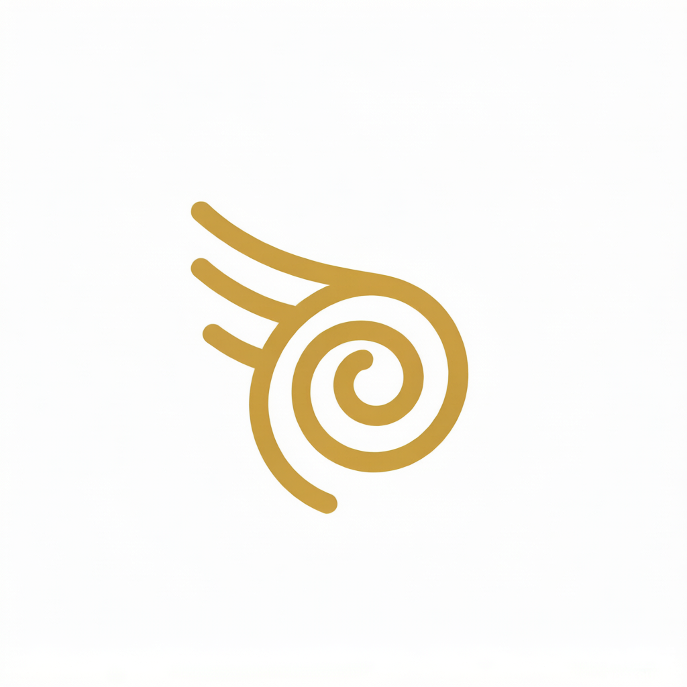
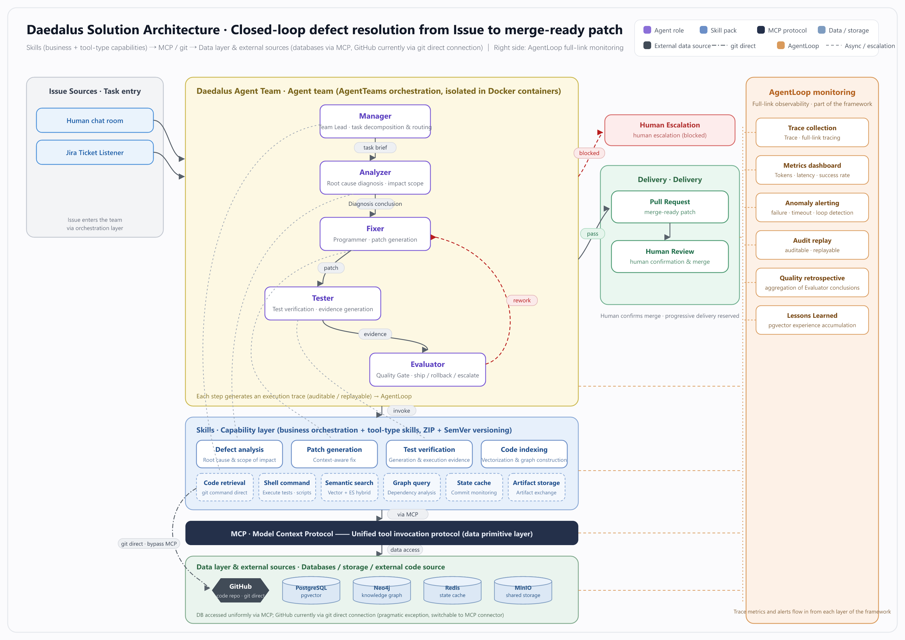

<div align="center">
  
  <h1>Daedalus</h1>
  <p><strong>An autonomous software company, built from agent teams.</strong></p>
  <p>From issue to resolution — architected, coded, tested, and shipped by AI agents working as one organization.</p>

  <p>
    <a href="https://github.com/agentscope-ai/AgentTeams"></a>
    
    
    
    
  </p>
</div>

---

## Why Daedalus?

In Greek mythology, **Daedalus** was the master craftsman — architect of the Labyrinth, maker of wings. He didn't just build things; he built *systems that solved impossible problems*.

Daedalus brings that spirit to software engineering. It is not a coding assistant, and not a demo. It is a **production-oriented, multi-agent organization** that mirrors the structure of a real software company: a team of specialized agents — each with a defined role, clear decision boundaries, and auditable traces — collaborating to autonomously resolve real development issues.

Today's Daedalus runs a closed-loop defect-resolution team. Tomorrow, it grows into the full company: design, development, testing, operations, and continuous integration — the entire software lifecycle, end to end.

## How It Works

An issue enters. A resolved, tested, verified patch exits. Everything in between is handled by the team:

<!-- Diagram source of truth: asset/how-it-works.mmd. Regenerate with: mmdc -i asset/how-it-works.mmd -o asset/how-it-works.png -b white -s 2 -->



Issues arrive through the team chat room or a Jira ticket listener. The Manager clones the target repository from GitHub, the team resolves the issue, and the result ships as a merge-ready pull request — today confirmed by a human reviewer before merge. Each agent runs in its own Docker container, coordinates through the AgentTeams orchestration layer, and shares artifacts through a common workspace. Every step leaves an execution trace — auditable, replayable, and accountable.

## The Team

| Role | Responsibility |
|------|----------------|
| **Manager** | Team lead. Receives the issue, clones the target repository, decomposes the task, routes work, and owns the final outcome. |
| **Analyzer** | Diagnoses root cause using the knowledge graph, semantic code search, and dependency analysis. |
| **Fixer** | The programmer. Writes the patch with full codebase context — dependency graphs, historical fixes, architectural constraints. |
| **Tester** | Writes and runs tests against the fix. No patch advances without evidence. |
| **Evaluator** | The quality gate. Reviews the complete work product and decides: ship it, send it back, or escalate to a human. |

New roles (architect, designer, SRE, release manager) plug into the same declarative YAML templates — the org chart is configuration, not code.

## Architecture

| Layer | Technology |
|-------|-----------|
| **Agent Orchestration** | [AgentTeams (Hiclaw)](https://github.com/agentscope-ai/AgentTeams) — declarative Worker / Team / Manager / Human resources |
| **Agent Runtime** | OpenClaw / QwenPaw / Hermes (pluggable) |
| **Execution Environment** | Docker — every agent isolated in its own container |
| **Vector Database** | PostgreSQL + pgvector — semantic & hybrid code search |
| **Knowledge Graph** | Neo4j  — code dependency & engineering knowledge |
| **State & Cache** | Redis — file-hash cache for commit status monitoring |
| **Shared Storage** | MinIO — artifact exchange between agents |
| **Skill Protocol** | MCP (Model Context Protocol) — domain skills served to every worker |

## Quick Start

### Prerequisites

| Requirement | Details |
|-------------|---------|
| **Docker Desktop** | Each agent role runs in its own Docker container. Install [Docker Desktop](https://www.docker.com/products/docker-desktop/) before proceeding. |
| **Memory** | At least **32 GB RAM** for local deployment — the full stack (agents, PostgreSQL, Neo4j, Redis, MinIO) is memory-intensive. |
| **Disk** | ~50 GB free for images, vectors, and knowledge-graph data. |

### Local Deployment

For running everything on your own machine, no remote server or SSH key is needed.

First-time setup:

```bash
./deploy/scripts/setup.sh
```

Daily operation — bring up the entire company with one command:

```bash
./deploy/scripts/start.sh
./deploy/scripts/stop.sh    # shut everything down
```

### Remote Server Deployment

When deploying to a remote server, pass the server IP and SSH key path:

```bash
./deploy/scripts/setup.sh <server-ip> [pem-path]
./deploy/scripts/start.sh <server-ip> [pem-path]
./deploy/scripts/start.sh <server-ip> [pem-path] stop    # shut everything down
```

## Evaluation

There are currently two ways to verify the agent team end-to-end:

**1. SWE-Bench automated runner**

`scripts/swe_bench_runner.py` drives the full pipeline against real SWE-Bench cases (pallets/flask). It submits issues through the AgentTeams flow (Analyzer → Fixer → Tester → Evaluator), collects patches, and validates them with the official SWE-Bench test harness.

```bash
# Full pipeline: index → submit → wait → verify
python scripts/swe_bench_runner.py

# List available Flask instances
python scripts/swe_bench_runner.py --list

# Dry run (plan only, no actions)
python scripts/swe_bench_runner.py --dry-run
```

**2. AgentTeams chat room**

Open the AgentTeams chat UI and send a task directly to the **Manager** agent. The Manager will decompose the issue, route work to the team, and drive the full resolution loop interactively. This is the fastest way to test a specific bug or feature request.

## Repository Layout

```
deploy/          AgentTeams installers, worker/team templates, env samples, ops scripts
...
```

## Roadmap

Daedalus is production-oriented, and the roadmap reflects that:

- **Jira integration** — a listener service that watches a Jira project and routes incoming issues directly to the agent team, closing the loop from ticket creation to resolved patch
- **More roles, full lifecycle** — expand from defect resolution to the complete software company: design → development → testing → operations → CI/CD
- **Engineering memory** — post-mortems and a living R&D knowledge base, so the team learns from every resolved issue instead of starting from zero
- **Progressive delivery** — canary release with automated result confirmation
- **Full-link observability** — AgentLoop integration for end-to-end agent monitoring
- **Skill engineering** — versioned, lifecycle-managed skill platform

## Acknowledgments

- [AgentTeams (Hiclaw)](https://hiclaw.io/) — the agent orchestration foundation
- [mini-swe-agent](https://github.com/SWE-agent/mini-swe-agent) — reference implementation
engineering can be

---

<div align="center">
  <sub>Daedalus — the craftsman never sleeps.</sub>
</div>
