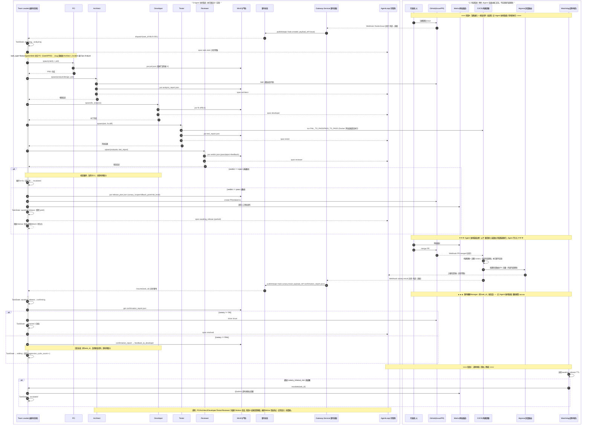

# 研发缺陷闭环协同系统 — 详细设计文档

> 版本：v3.0
> 日期：2026-09-01
> 基于：补充设计文档 v1.2 + prompt.md 讨论结论 + mini-swe-agent 优秀实践 + 多智能体角色与流程扩展修改计划 v1.8
> v3.0 变更（多智能体角色与流程扩展，技能包 v0.2.0）：
>   1. 角色架构从 4+1 扩展为 **7 角色**：Team Leader / PO / Architect / Developer / Tester / Reviewer / Ops Analyst（原 Manager→Team Leader、Analyzer→Architect、Fixer→Developer、Evaluator→Reviewer，新增 PO 与 Ops Analyst）。
>   2. 新增三类任务类型路由：`incident` / `bug` / `feature`（含 greenfield 变体），由 pipeline-router 按任务信封（task envelope）分发。
>   3. 新增失败类别回退仲裁：Reviewer 输出 `failure_class`（code/design/requirement/environment/visual），Team Leader 据此路由回退目标阶段。
>   4. 新增前端视觉能力：`visual_check` 工具（Playwright DOM 提取 + 规则引擎），PRD `visual_acceptance` / ADD `ui_spec` 契约。
>   5. 新增 6 个 JSON Schema（prd/add/failure_class/diagnosis/test_plan/clarification）与 6 个新技能（prd-authoring / architecture-design / ops-diagnosis / env-inventory / visual-check / test-plan）。
>   6. 角色模型对齐 SiliconFlow 实际可用 ID（§2.4）。
>   7. 架构总览图更新为 7 角色三路由版（§1.1）。
> v2.1 变更：索引从 per-commit 命名空间改为单命名空间 + 增量更新（Redis file-hash 追踪）
> v2.2 变更：
>   1. 修正 Tester 设计——**测试在 Docker 沙箱内真实执行**（非静态代码分析），`test_runner` 已由 MCP 技能下沉为 Worker 容器内原生 pytest 执行；`result_judge` 为 Tester 的裁定技能。
>   2. 新增 §8 测试验证（基于 SWE-Bench 真实测试环境）：测试环境构建、用例执行、结果收集、验证标准。
>   3. 新增 §9 灰度发布与结果确认：发布计划产物、任务状态机扩展、事件驱动唤醒、回归闭环、超时哨兵。
>   4. 新增 §10 全链路总览时序图（UML 时序图，含 Agent 系统 / 外部系统边界）。
>   5. 同步审校 §1.2 / §1.3 / §2.3 / §2.5(新增) / §4 / §5.2 / §7 与当前实现一致。

---

## 1. 架构总览

### 1.1 系统分层（v3.0 更新：7 角色）


```
┌──────────────────────────────────────────────────────────────┐
│                    AgentTeams 平台层                           │
│  Higress(网关) │ Tuwunel(IM) │ MinIO(存储) │ Element Web(入口) │
├──────────────────────────────────────────────────────────────┤
│  编排层：Team Leader（coordinator，任务信封解析、三类路由、回退仲裁）  │
├──────────────────────────────────────────────────────────────┤
│  业务层：6 个 Worker Agent
│  feature/greenfield: PO → Architect → Developer → Tester → Reviewer │
│  bug:                 Architect → Developer → Tester → Reviewer      │
│  incident:            Ops Analyst（L0 诊断）→ 转 bug 或 escalated      │
├──────────────────────────────────────────────────────────────┤
│  数据层：向量数据库(pgvector) │ 知识图谱(Neo4j) │ 全文检索(Meilisearch) │ Redis(缓存) │
│  每个仓库单命名空间（ns = repo_name），Redis 追踪 file hash 做增量更新   │
└──────────────────────────────────────────────────────────────┘
```

> 架构图源文件：`asset/architecture.svg`（可编辑源码；导出 PNG 时用任意 SVG→PNG 渲染器按
> viewBox 尺寸截图即可，例如 `python -m playwright` 或 `cairosvg`；本地可选用
> `.qoder/skills/svg-visual-review/` 项目技能，该目录为 IDE 本地工具，不入仓库）。

### 1.2 核心设计原则

| 原则 | 说明 |
|------|------|
| **任务信封驱动路由** | 入口任务带结构化信封（task_type/task_id/repo/env 等），Team Leader 依据 task_type 分发 incident/bug/feature 三条流水线（greenfield 为 feature 的 repo 为空变体） |
| **语义工具管找，bash 管干** | Architect/Reviewer 用语义检索，Developer/Tester 用 bash |
| **有约束的自主** | 每个 Worker 在工具集 + 成本/步数/格式约束内自主决策 |
| **三库融合，一工具暴露** | 向量+图谱+关键词的复杂度封装在 hybrid_search 内部 |
| **增量索引** | 单命名空间 per repo，Redis 追踪 file hash，只更新变更文件，嵌入缓存复用 |
| **角色级工具限制** | Developer 不给搜索工具，Tester/Reviewer 对**业务仓库**的 bash 只读（仅读取/检索代码与构建产物）；Ops Analyst 对生产环境 L0 只读 |
| **测试真实执行** | Tester 的验证**不是静态分析**：在 SWE-Bench 预构建的 Docker 评估容器中拉起真实运行环境，应用修复补丁后**实际执行测试用例**（pytest），依据真实返回码判定 |
| **failure_class 回退仲裁** | Reviewer 裁定时输出失败类别（code/design/requirement/environment/visual），Team Leader 按类别路由回退目标阶段而非固定回退 |
| **产物即数据** | 每个 Worker 的产出写入 MinIO，作为下游 Worker 的输入 |
| **视觉验收可验证** | PRD `visual_acceptance` + ADD `ui_spec` 声明视觉契约，`visual_check`（Playwright DOM 提取 + 规则引擎）零模型成本验证 |

### 1.3 MinIO 共享存储配置

Worker 间文件交换通过 MinIO 共享存储实现，所有 Worker YAML 通过 `env:` 声明连接信息：

```yaml
env:
  - name: MINIO_ENDPOINT
    value: ${MINIO_ENDPOINT:-http://minio:9000}
  - name: MINIO_ACCESS_KEY
    value: ${MINIO_ACCESS_KEY}
  - name: MINIO_SECRET_KEY
    value: ${MINIO_SECRET_KEY}
  - name: MINIO_BUCKET
    value: ${MINIO_BUCKET:-shared-tasks}
```

**数据流**：
- Team Leader：`git clone` → `tar czf` → `mc cp` 推送到 MinIO
- Architect：`mc cp` 拉取 → 分析 → 推送报告（bug 诊断 / feature ADD）
- Developer：`mc cp` 拉取 → 修改代码 → 推送 diff
- Tester：`mc cp` 拉取 → **拉起 Docker 评估容器、应用 fix.diff 与 test patch、真实执行 pytest** → 推送 `test_report.json`

> 说明：Tester 的「测试」指启动 SWE-Bench 评估镜像（`sweb.eval.x86_64.<instance_id>`）容器，在 `/testbed`（已激活 `testbed` conda 环境）中应用补丁并**真实运行测试命令**，而非仅做静态代码比对。详见 §8。
- Reviewer：`mc cp` 拉取 → 审查 → 推送结论（含 failure_class）

所有 MinIO 操作通过 Worker 容器内原生 bash（`mc` CLI）执行，不经过 MCP Server。

---

## 2. 角色架构（v3.0 变更：7 角色）

### 2.1 从 v2.x 到 v3.0 的演进

| v2.x（4+1 Agent） | v3.0（7 Agent） | 变更说明 |
|---|---|---|
| Manager | Team Leader（coordinator.yaml） | 重命名并强化：任务信封解析、三类路由、failure_class 回退仲裁 |
| — | PO（po.yaml） | 新增：Gate0 需求澄清（clarification）、PRD 产出与需求追溯 |
| Analyzer | Architect（architect.yaml） | 重命名并扩展：bug 根因分析 + feature/greenfield 架构设计（ADD） |
| Fixer | Developer（developer.yaml） | 重命名并扩展：实现 + 视觉自检（visual self-check） |
| Tester | Tester（tester.yaml） | 扩展：测试设计前置（test-plan）、视觉回归 |
| Evaluator | Reviewer（reviewer.yaml） | 重命名并强化：双闸门审查（PRD review / design review）、failure_class 输出、知识沉淀 |
| — | Ops Analyst（ops-analyst.yaml） | 新增：incident 诊断、L0/L1/L2 操作分级、环境盘点 |

### 2.2 流水线（按任务类型路由）

```
                        ┌─────────────┐
      任务信封 ──────► │ Team Leader │
                        └──────┬──────┘
              ┌───────────────┼───────────────┐
         task_type=      task_type=      task_type=
         feature/greenfield  bug           incident
              │               │               │
              ▼               ▼               ▼
  PO → Architect →    Architect →      Ops Analyst（L0 诊断）
  Developer → Tester → Developer →       │
  Reviewer             Tester →           ├─ 转 bug（走左中路）
  （含双闸门：          Reviewer           └─ escalated / resolved
   prd_review /
   design_review）

  回退：Reviewer 输出 failure_class（code/design/requirement/environment/visual）
        → Team Leader 路由回退目标阶段（code→developing、design→designing、
          requirement→prd_drafting、environment→ops_diagnosing、visual→developing）
  超限：单阶段重试 ≤ 2、全局 PO 回退 ≤ 1、MAX_ROUND=3 超限 → escalated
```

各任务类型的完整阶段序列见附录 X.2（实现于
`deploy/packages/rd-defect-skills/skills/pipeline-router/scripts/task_router.py`
的 `_PIPELINES` 路由表）。

### 2.3 工具分配

> 仅列出 MCP Server 注册的组合技能（`mcp_server/composed_tools.py`，Registry 模式）。
> 数据访问原语（pgvector/Neo4j/Meili/Redis/AST 共 15 个 + `hybrid_search`）由
> `mcp_server/server.py` 统一注册，供组合技能内部编排，不直接暴露给 Worker。

| 工具 | Team Leader | PO | Architect | Developer | Tester | Reviewer | Ops Analyst |
|------|-------------|-----|-----------|-----------|--------|----------|------------|
| task_router | Y | - | - | - | - | - | - |
| state_manager | Y | - | - | - | - | - | - |
| handoff_manager | Y | - | - | - | - | - | - |
| release_plan_generator | Y | - | - | - | - | - | - |
| release_decision | Y | - | - | - | - | - | - |
| canary_watchdog | Y | - | - | - | - | - | - |
| repo_indexer | - | - | Y | - | - | - | - |
| context_packer | - | - | Y | - | - | - | - |
| root_cause_analyzer | - | - | Y | - | - | - | - |
| repair_planner | - | - | - | Y | - | - | - |
| risk_gate | - | - | - | Y | - | - | - |
| dep_graph_analyzer | - | - | - | - | - | Y | - |
| contract_checker | - | - | - | - | - | Y | - |
| knowledge_extraction | - | - | - | - | - | Y | - |

**技能包技能**（`deploy/packages/rd-defect-skills/` v0.2.0，随 Worker ZIP 分发，
经 `manifest.json` 的 worker 技能映射按角色分配）：

| 技能 | 归属角色 |
|------|----------|
| pipeline-router / prd-authoring | Team Leader / PO |
| architecture-design / root-cause-analysis / repo-index / code-search / impact-analysis / module-lookup | Architect |
| repair-planning / patch-generate / multi-file-edit / code-read / bash-exec | Developer |
| test-plan / test-run / result-judge / visual-check | Tester |
| pipeline-router（闸门）/ visual-check（核验）| Reviewer |
| ops-diagnosis / env-inventory / lesson-lookup | Ops Analyst |

**Worker 原生技能**（不在 MCP Server 注册，由容器内 bash 直接处理）：

| 工具 | Team Leader | PO | Architect | Developer | Tester | Reviewer | Ops Analyst |
|------|-------------|-----|-----------|-----------|--------|----------|------------|
| read_code | - | - | Y | Y | Y | Y | - |
| run_bash | - | - | Y(读写) | Y(读写) | Y(只读) | Y(只读) | Y(L0 只读) |
| write_reproduction | - | - | Y | - | - | - | - |
| patch_generator | - | - | - | Y | - | - | - |
| test_runner | - | - | - | - | Y | - | - |
| multi_file_editor | - | - | - | Y | - | - | - |
| visual_check | - | - | - | Y(自检) | Y(回归) | Y(核验) | - |

> **Tester 测试机制澄清（v2.2 修正，v3.0 保留）**：
> - `test_runner` 已**从 MCP Server 技能下沉为 Worker 容器内原生执行**。Tester 在 SWE-Bench 评估 Docker 容器内通过 `run_bash` 调用 pytest 真实运行测试，**不做静态分析**。
> - `result_judge`（技能包 prompt-only Skill，归属 Tester）是 Tester 的**裁定技能**：读取 `test_report.json` 中的 `test_result`，决策 `success`（通过）/ `retry`（进入下一轮 re-fix）/ `handoff`（人工移交）。详见 §8。

### 2.4 模型分配（v3.0 对齐 SiliconFlow 实际可用 ID）

| 角色 | 模型（SiliconFlow ID） | 选型理由 |
|------|------------------------|----------|
| Team Leader | `deepseek-ai/DeepSeek-V4-Pro` | 任务信封解析与回退仲裁需要强推理 |
| PO | `Qwen/Qwen3.6-35B-A3B` | MoE 架构（35B 总参数仅激活 3B），长上下文适合 PRD 起草，成本最低档 |
| Architect | `moonshotai/Kimi-K2.7-Code` | 代码专用，适合跨文件根因分析与架构设计 |
| Developer | `deepseek-ai/DeepSeek-V4-Pro` | 实现质量优先 |
| Tester | `deepseek-ai/DeepSeek-V4-Pro` | 理解 pytest 报错与视觉回归证据 |
| Reviewer | `zai-org/GLM-5.2` | 平台审查最强模型，档位高于 Architect/Developer，质量门禁需要“想得深” |
| Ops Analyst | `deepseek-ai/DeepSeek-V4-Pro` | incident 诊断与环境盘点 |

> 配置方式：每个 Worker YAML 通过 `model:` 字段指定，`modelProvider: default` 作为 fallback。
> 网关与 Key 经 `deploy/config.env`（AGENTTEAMS_* 契约）注入，模型变更只需改 YAML 后重跑 `register_resources`。

---

### 2.5 任务状态机（TaskState）

每个任务 `task_id` 的生命周期由 Team Leader 维护的状态机驱动，状态持久化于 `TaskState`（独立于临时 Worker 会话，会话销毁后状态不丢失）。

> 按任务类型分为三条状态机（对齐 `pipeline-router/scripts/task_router.py` 的 `_PIPELINES` 路由表）：
> §2.5.1 bug（SWE-bench 主链路）、§2.5.2 feature / greenfield、§2.5.3 incident。
> 三者共用的后段（evaluating → awaiting_release → confirming → resolved）与回退规则
> （failure_class 路由，见 §2.2）一致；双闸门（prd_review / design_review）阶段
> 带独立重试计数（单阶段 ≤ 2）。

#### 2.5.1 bug 状态机（SWE-bench 主链路）

```
                      ┌─────────────┐
                      │  planning   │  (任务创建/派发)
                      └──────┬──────┘
                             ▼
                      ┌─────────────┐
                      │ analyzing   │  (Architect 根因分析)
                      └──────┬──────┘
                             ▼
                      ┌─────────────┐
           ┌─────────│  editing    │(Developer 修复, 可循环)
           │          └──────┬──────┘
           │                 ▼
           │          ┌─────────────┐
           │          │  testing    │  (Tester 真实测试)
           │          └──────┬──────┘
           │                 ▼
           │          ┌─────────────┐
           │          │ evaluating  │  (Reviewer 裁定)
           │          └──┬──────┬───┘
           │   reject(≤3)│      │ pass
           │             ▼      ▼
           │      (回 editing)  ┌──────────────────┐
           │                    │ awaiting_release │ (受控 yield: 等人工审批+发布)
           │                    └──┬───────────┬───┘
           │            canary OK  │           │ canary FAIL / 超时
           │                      ▼           ▼
           │              ┌────────────┐  ┌────────────┐
           │              │ confirming │  │  editing   │ (回归分支, regression_cycle++)
           │              └─────┬──────┘  └─────┬──────┘
           │                    ▼                │
           └──────────────► ┌────────────┐      │
                            │  resolved   │◄─────┘ (回归成功/达上限)
                            └────────────┘
                                    │  (或) 连续 3 次评估驳回 / 回归超限 / 超时无结果
                                    ▼
                            ┌────────────┐
                            │ escalated  │  (人工介入, 终态)
                            └────────────┘
```

#### 2.5.2 feature / greenfield 状态机（含双闸门）

```
┌──────────┐   ┌──────────┐   ┌───────────────┐
│ triaging │──►│clarifying│──►│ prd_drafting  │ (PO: Gate0 需求澄清 → PRD)
└──────────┘   └──────────┘   └───────┬───────┘
                                      ▼
                             ┌───────────────┐  驳回(单阶段≤2)
                             │  prd_review   │ (Reviewer 闸门 1)──┐
                             └───────┬───────┘               │
                                     │ pass                  │
                                     ▼                       │ failure_class=requirement
                             ┌───────────────┐               │ 回退 prd_drafting
                             │   designing   │ (Architect: ADD)◄┘
                             └───────┬───────┘  (greenfield 此时为零仓库架构)
                                     ▼
                             ┌───────────────┐  驳回(单阶段≤2)
                             │ design_review │ (Reviewer 闸门 2)──┐
                             └───────┬───────┘               │
                                     │ pass                  │
                                     ▼                       │ failure_class=design
                   ┌─────────────────┐                       │ 回退 designing
                   │  bootstrapping  │ (仅 greenfield:        │
                   │  [greenfield]   │  Developer 脚手架)    │
                   └────────┬────────┘                       │
                            ▼                                │
                      ┌───────────┐                          │
                      │developing │ (Developer 实现+视觉自检≤3轮)
                      └─────┬─────┘
                            ▼
                  ┌────────────────┐   ┌─────────────────┐
                  │test_designing  │──►│ test_executing  │ (Tester: 测试设计前置 → 真实执行+视觉回归)
                  │ (仅 feature)   │   └────────┬────────┘
                  └────────────────┘            ▼
                                       ┌─────────────┐  驳回(≤3)
                                       │  evaluating │ (Reviewer 裁定)──┐
                                       └──────┬──────┘               │
                                              │ pass                 │
                                              ▼                      │ failure_class 路由回退
                                      ┌──────────────────┐          │ code/visual→developing
                                      │ awaiting_release │◄─────────┘ design→designing
                                      └──────┬───────────┘   requirement→prd_drafting
                                （后段同 bug：│ confirming → resolved /
                                  environment→ops_diagnosing）
```

> greenfield 与 feature 的差异：`designing` 后增加 `bootstrapping`（Developer 仓库
> 脚手架/骨架），且省略 `test_designing`（无存量测试可参考，直接 `test_executing`）。
> 入口判定：feature 且 repo 为空 → Team Leader 自动切 greenfield 流水线。

#### 2.5.3 incident 状态机（L0/L1/L2 纪律）

```
┌──────────┐   ┌─────────────────┐   ┌───────────────────┐
│ triaging │──►│ ops_diagnosing  │──►│  ops_remediation  │ (Ops Analyst)
└──────────┘   │ (L0 只读诊断)   │   │  (L1/L2 按 Escalation)│
               └───┬─────────┬───┘   └─────────┬─────────┘
                   │         │                   │
                   │ 诊断超时│ 定位为代码缺陷      │ L0 止血成功(如切流/回滚)
                   │         │ (failure_class   │ 或环境问题处置完成
                   │         │  =environment    ▼
                   │         │  也回退至此)  ┌─────────┐
                   │         └─────────────►│resolved │ (关单+沉淀诊断报告)
                   │                        └─────────┘
                   │ 定位为代码缺陷（转 bug 流水线，保留 incident 上下文）
                   │                             │
                   │        ┌────────────────────────────┐
                   └──────►│ 转 bug：analyzing → … (§2.5.1) │
                            └────────────────────────────┘
                   │ 诊断超时 / L2 无法定位
                   ▼
             ┌───────────┐
             │ escalated │ (人工介入, 终态；L0/L1/L2 纪律见附录 X.1)
             └───────────┘
```

> incident 纪律：L0 只读（查日志/指标/配置，不碰生产数据）；L1 低风险变更需
> 审批（如重启实例）；L2 仅出方案不执行。诊断结论带 `diagnosis.schema.json`
> 结构化报告；若根因为代码缺陷则**转 bug 流水线**（同 task_id，保留诊断上下文），
> 失败类别为 environment 时也可由其他流水线回退到 `ops_diagnosing`。

**关键状态说明**（三条状态机共用）：

| 状态 | 含义 | 退出条件 |
|------|------|----------|
| `clarifying` | （feature）Gate0 需求澄清：PO 按 clarification schema 问答，模糊需求回问用户 | 信息充分 → `prd_drafting`；无法澄清 → `escalated` |
| `prd_drafting` | （feature/greenfield）PO 产出 PRD（含 visual_acceptance / 需求追溯） | PRD 完成 → `prd_review`；failure_class=requirement 回退至此 |
| `prd_review` | （feature/greenfield）Reviewer 闸门 1：PRD 完整性/可测性/视觉验收可验证性审查 | pass → `designing`；驳回（单阶段≤2）回 `prd_drafting` |
| `designing` | （feature/greenfield）Architect 产出 ADD（含 ui_spec / 技术选型理由） | ADD 完成 → `design_review`；failure_class=design 回退至此 |
| `design_review` | （feature/greenfield）Reviewer 闸门 2：架构合理性/依赖风险审查 | pass → `bootstrapping`(greenfield) / `developing`；驳回（单阶段≤2）回 `designing` |
| `bootstrapping` | （仅 greenfield）Developer 仓库脚手架/骨架搭建 | 骨架可运行 → `developing` |
| `developing` | （feature/greenfield）Developer 实现 + 视觉自检（≤3 轮） | 完成 → `test_designing`/`test_executing`；failure_class=code/visual 回退至此 |
| `test_designing` | （仅 feature）Tester 测试设计前置（test_plan.schema.json，先于实现设计用例） | 用例集就绪 → `test_executing` |
| `ops_diagnosing` | （incident）Ops Analyst L0 只读诊断，产出 diagnosis.schema.json 报告 | 定位代码缺陷 → 转 bug；止血成功 → `ops_remediation`/`resolved`；超时 → `escalated`；failure_class=environment 回退至此 |
| `ops_remediation` | （incident）按 L0/L1/L2 纪律处置（L1 变更需审批，L2 仅出方案） | 处置完成 → `resolved`；需代码修复 → 转 bug |
| `awaiting_release` | Reviewer 通过、PR 已提交、等待人工审批与发布；Worker 会话 yield（释放算力，状态+MinIO 持久化） | canary 结果事件 / 超时哨兵 |
| `confirming` | canary 结果已返回，Team Leader 被事件唤醒，读 `confirmation_report.json` 做最终判定 | 进入 `resolved` 或按 failure_class 回退 |
| `resolved` | 任务完成终态（Issue 已 `close(FIXED)` 或回归成功） | — |
| `escalated` | 人工介入终态（评估驳回超限 / 回归超限 / `canary_timeout` 超时 / incident 诊断超时） | — |

> 循环计数器：`evaluation_cycle_count`（评估驳回循环，上限 3，见 §7）、`regression_cycle_count`（灰度回归循环，上限 3，见 §9）、双闸门独立重试计数（prd_review / design_review 各 ≤ 2）、PO 全局回退 ≤ 1、MAX_ROUND=3 超限 → `escalated`。

---

## 3. 数据层详细设计

### 3.1 增量索引架构（v2.1 变更）

#### 3.1.1 设计动机

旧方案按 `{repo}_{commit[:8]}` 为每个 commit 创建独立命名空间，N 个 commit = N 份近乎相同的数据。
SWE-bench 场景下（如 Flask 12 个 issue 对应 7 个 base_commit），存储浪费严重且每次全量重建索引耗时长。

新方案改为 **单命名空间 per repo + Redis file-hash 追踪 + 增量更新**：

| 对比维度 | 旧方案（per-commit ns） | 新方案（增量更新） |
|----------|-------------------------|-------------------|
| 命名空间 | N 个 commit = N 个 ns | 1 个 repo = 1 个 ns |
| 存储量 | 大量重复数据 | 仅保留最新状态 |
| 索引速度 | 每次全量解析+嵌入 | 仅解析变更文件 |
| 嵌入 token | 全量重新嵌入（缓存可部分复用） | 仅新增内容需嵌入（缓存命中率高） |
| 版本回退 | 天然支持（旧 ns 还在） | 需 reset 后重建 |

#### 3.1.2 命名空间规则

```
ns = repo_name   （如 "flask"，不再拼接 commit hash）
```

- pgvector：`code_chunks` 表 `ns` 列值为 repo 名
- Neo4j：节点 `ns` 属性值为 repo 名
- Meilisearch：索引名为 repo 名
- Redis：`repo_state:{repo_name}` 存储当前索引状态

#### 3.1.3 Redis 状态追踪

Redis 新增 `repo_state:{repo}` key，存储 JSON：

```json
{
  "commit": "abc12345...",
  "file_hashes": {
    "src/flask/app.py": "sha256_hex_64",
    "src/flask/routes.py": "sha256_hex_64",
    ...
  }
}
```

- `commit`：当前已索引的 commit
- `file_hashes`：每个源文件的内容 hash（SHA256），用于 diff 检测变更

#### 3.1.4 增量更新流程

```
repo_indexer(repo_path, commit)
    │
    ├── Step 1: 从 Redis 获取当前状态（old_commit + old_file_hashes）
    │
    ├── Step 2: 扫描新仓库，计算 new_file_hashes
    │
    ├── Step 3: Diff 计算
    │   ├── removed_paths = old - new（已删除文件）
    │   ├── added_paths   = new - old（新增文件）
    │   ├── changed_paths = 同路径但 hash 不同（修改文件）
    │   └── unchanged     = 同路径且 hash 相同（未变更）
    │
    ├── Step 4: 删除旧数据（removed + changed 文件）
    │   ├── pgvector.delete_by_paths(paths, ns)
    │   ├── neo4j.delete_by_paths(paths, ns)
    │   └── meili.delete_by_paths(paths, ns)
    │
    ├── Step 5: 仅解析 added + changed 文件（tree-sitter）
    │
    ├── Step 6: 嵌入（content hash 缓存命中则复用）+ 写入三库
    │
    ├── Step 7: 重建关系边（CALLS / HAS_METHOD / IMPORTS，仅新 chunk）
    │
    └── Step 8: 更新 Redis 状态（new_commit + new_file_hashes）
```

#### 3.1.5 嵌入缓存（Content Hash）

嵌入缓存 key 使用代码块内容 SHA256 全 64 位 hex：

```python
cache_key = hashlib.sha256(content.encode()).hexdigest()  # 全 64 位
redis_key = f"emb:{cache_key}"
```

优势：
- 天然 commit-safe：内容未变则跨 commit 命中缓存
- 增量更新时，未变更 chunk 直接复用已有向量，零 token 消耗
- 避免以 `path:symbol:line` 做 key 的陷阱（同位置不同内容会取错向量）

#### 3.1.6 版本回退处理

当需要回退到更早的 commit（如 SWE-bench 测试前需清空后续数据防止漏题）：

```
reset_db(repo_name="flask")
    ├── pgvector.delete_all(ns="flask")    # 删除所有代码块
    ├── neo4j.delete_all(ns="flask")       # 删除所有节点和关系
    ├── meili.delete_all(ns="flask")       # 清空索引文档
    └── redis.clear_repo_state("flask")    # 清除状态标记
```

回退后重新执行 `repo_indexer` 将作为首次索引（全量），后续 commit 则增量更新。

### 3.2 三库融合实现

```
hybrid_search(query, top_k, ns)
    │
    ├── 向量召回（pgvector，余弦相似度）──┐
    │                                      ├── RRF 融合 → top_k 结果
    ├── 关键词召回（Meilisearch）──────────┘
    │
    └── 图谱扩充（Neo4j，CALLS/IMPORTS/HAS_METHOD）
         → graph_expansion（单独返回，不挤占直接命中名额）
```

---

## 4. 源码结构

```
domain_skills/ → mcp_server/（v3.0 重命名）
├── server.py             # MCP Server 入口（FastMCP，Worker 通过 mcporter 连接）
├── composed_tools.py     # 组合技能层（Registry 模式，@register 按角色注册）
├── mcp_primitives.py     # 数据访问原语（pgvector/Neo4j/Meili/Redis/AST/hybrid_search）
├── index_and_search.py   # 索引+检索联调脚本（eval helper，HTTP 调用 MCP Server）
├── telemetry.py          # OTel 可观测
├── db/
│   ├── base.py           # DbUnavailable + make_ns + content_hash
│   ├── config.py         # 连接配置
│   ├── schema.py         # 一键初始化（支持 ns）
│   ├── pgvector.py       # 向量检索（单 ns + delete_by_paths/delete_all）
│   ├── neo4jgraph.py     # 知识图谱（单 ns + delete_by_paths/delete_all）
│   ├── meili.py          # 全文检索（单 ns + delete_by_paths/delete_all）
│   ├── redis_cache.py    # 缓存（repo_state 追踪 + content hash 嵌入缓存）
│   └── lessons.py        # 经验知识库（lessons 表）
├── embed/
│   └── embeddings.py     # 嵌入服务
└── code/
    └── ast_parser.py     # tree-sitter 多语言 AST 解析

deploy/
├── workers/              # 7 角色 Worker YAML（v3.0）
│   ├── coordinator.yaml      # Team Leader（任务信封、路由、回退仲裁）
│   ├── po.yaml               # PO（Gate0 / PRD）
│   ├── architect.yaml        # Architect（诊断 / ADD）
│   ├── developer.yaml        # Developer（实现 / 补丁）
│   ├── tester.yaml           # Tester（测试设计 / 执行 / 视觉回归）
│   ├── reviewer.yaml         # Reviewer（质量门禁 / failure_class / 知识沉淀）
│   └── ops-analyst.yaml      # Ops Analyst（incident 诊断 / L0-L2 分级）
├── teams/
│   ├── rd-defect-team.yaml   # Team 资源（7 成员）
│   ├── default-manager.yaml  # Manager 资源模板
│   └── admin-human.yaml      # Human 资源模板
├── packages/
│   └── rd-defect-skills/     # 技能包源目录（v0.2.0）
│       ├── manifest.json     # 技能清单 + worker 技能映射 + 版本
│       ├── schemas/          # 6 个 JSON Schema（prd/add/failure_class/diagnosis/test_plan/clarification）
│       └── skills/           # 23 个技能（pipeline-router / prd-authoring /
│                             #   architecture-design / ops-diagnosis / env-inventory /
│                             #   visual-check / test-plan / patch-generate / …）
│                             # 构建产物：rd-defect-skills-v0.2.0.zip（Worker YAML 引用）
├── scripts/
│   ├── install.sh            # 统一安装（DB 栈 / MCP / AgentTeams / 技能包 / 资源注册）
│   ├── run.sh                # 日常启停（start/stop/restart/status）
│   └── lib/common.sh         # 共享库（ensure_playwright 等；RD_WORKERS=7 角色）
├── install/
│   └── agentteams-install.sh # AgentTeams 官方安装器封装
├── db/
│   └── docker-compose.db.yml # 数据库编排（PostgreSQL/Redis/Meili/Neo4j）
├── config.env.example       # 唯一配置模板（复制为 config.env 填写）
└── README.md

# Worker 运行时产物（宿主机绑定挂载 ~/hiclaw-fs）：
#   ~/hiclaw-fs/agents/<name>/SOUL.md     # Worker 角色灵魂（来自 YAML spec.files.soul）
#   ~/hiclaw-fs/agents/<name>/AGENTS.md   # Worker 步骤定义（来自 YAML spec.files.agents）
#   ~/hiclaw-fs/agents/<name>/openclaw.json  # Worker 运行时配置（模型、通道等）
#   ~/hiclaw-fs/agents/<name>/.copaw/     # copaw 运行状态（仅 Manager）
#
# Manager Web 控制台运行时：
#   ~/hiclaw-manager.env  # Manager 容器环境变量（安装器自动生成，HICLAW_DEFAULT_MODEL 等）

worker_bridge/ — 已移除（Worker 通过 MCP 协议直接连接 mcp_server）

scripts/
└── swe_bench_runner.py    # SWE-bench 自动化测试（增量索引 → 派单给 Agent（v3.0 成员名校验为 7 角色） → 等待完成 → 隔离 venv 评估，见 §8）

# Tester 测试执行环境（v3 更新）：
#   优先 Docker 容器隔离（需 /var/run/docker.sock），退回到隔离 venv。
#   在 venv 内安装兼容依赖（werkzeug<2.3, pytest<9），使用 -W default 抑制
#   DeprecationWarning，实现完全隔离的测试执行。SWE-bench 官方评估镜像暂未接入。
#   详见 §8.1–§8.2。
```

---

## 5. SWE-bench 集成

### 5.1 增量索引构建

```
按时间顺序处理所有 base_commit（git log date 排序）：

对每个 base_commit（按时间从前向后推进）:
  1. git checkout base_commit
  2. repo_indexer(repo_path, commit=base_commit)
     → ns = repo_name（如 "flask"，单命名空间）
     → Redis 追踪 file_hashes，自动 diff 变更
     → 仅解析 added + changed 文件
     → 嵌入缓存命中则复用（零 token）
     → 更新 Redis 状态

  3. 处理该 commit 下的所有 issue（提交 → 等待 → 评估）
  4. 所有 issue 验证完毕后，推进到下一个 commit
```

**关键特性**：
- 单命名空间：所有 commit 共享同一 ns，数据库只保留最新状态
- 增量更新：相邻 commit 间差异小，索引速度快、token 消耗低
- 时间顺序：确保数据库始终从旧到新推进，接近真实开发场景
- 防漏题：测试前可 `reset_db()` 清空所有数据，从零开始构建

### 5.2 任务提交（swe_bench_runner.py）

```python
# 自动化脚本：按 commit 分组、时间排序、增量索引、逐组处理
from collections import defaultdict

commit_groups = defaultdict(list)
for inst in swebench_instances:
    commit_groups[inst["base_commit"]].append(inst)

sorted_commits = sorted(commit_groups.keys(), key=get_commit_date)

for commit in sorted_commits:
    # 增量索引（单命名空间，自动 diff）
    index_repo(repo_path, commit, ns=repo_name)

    # 处理该 commit 下的所有 issue
    for inst in commit_groups[commit]:
        submit_task(inst)           # Matrix 消息 → Team Leader
        result = wait_for_completion(inst["instance_id"])
        if result.patch:
            evaluate_patch(inst, result.patch)  # SWE-bench 测试验证（详细执行见 §8）

    # 该 commit 所有 issue 处理完毕，推进到下一个 commit
```

### 5.3 Patch 收集

```python
# 只收集 Reviewer 确认完成的任务
# verdict.json 中任务状态在 summary.status 字段（值为 "completed" / "task_complete"）
# runner 兼容旧格式的顶层 verdict 字段（兜底），实际主要走 summary.status
for task in completed_tasks:
    verdict = load_verdict(task)
    status = verdict.get("verdict") or verdict.get("summary", {}).get("status", "unknown")
    if status in ("completed", "task_complete"):
        diff = load_diff(task)
        predictions.append({
            "instance_id": task["instance_id"],
            "model_patch": diff
        })
```

---

## 6. 借鉴 mini-swe-agent 的优秀实践

| 实践 | 说明 | 本项目应用 |
|------|------|----------|
| 线性历史 | Agent 交互为线性消息序列 | Team Leader 维护线性流水线状态 |
| 步数限制 | step_limit 控制 Agent 步数 | MAX_ROUND=3, TASK_TIMEOUT_MIN=30 |
| 成本限制 | cost_limit 控制 LLM 调用成本 | TOKEN_BUDGET=100000 |
| 结构化输出 | 每步产出结构化 JSON | 所有 Skill 输入输出均为 JSON |
| 极简工具集 | bash-only 降低选择复杂度 | 三库融合为单一工具接口 |
| 默认工作流 | system prompt 写入推荐流程 | Architect 默认 workflow 写入 soul |
| 轨迹保存 | trajectory 序列化到文件 | 所有中间产出写入 MinIO |

---

## 7. 异常处理

| 异常场景 | 处理策略 |
|----------|----------|
| Architect 找不到根因 | 超时 → 通知人类补充信息 |
| Developer 修改引入新失败 | Tester 报告 → Team Leader 按 failure_class=code 回退 Developer（≤3次） |
| Reviewer 连续 3 次驳回 | escalated → 人工介入 |
| 索引过期/不一致 | Redis repo_state 追踪当前 commit，增量更新保证数据一致 |
| LLM 调用超限 | 指数退避重试，最多 4 次 → 暂停通知 Team Leader |
| fix.diff 无法 apply | Tester 报告冲突 → Team Leader 回退 Developer 基于最新 commit 重改 |
| 灰度发布后 canary 失败 | Issue 保持 OPEN，`confirmation_report` 回灌 Developer 走回归分支（≤3 次，`regression_cycle_count`）；超限 → `escalated` |
| `awaiting_release` 超时无结果 | Watchdog 巡检 TTL（`canary_timeout_min`）→ 标 `escalated` 并 Matrix `@admin` 通知人工 |

---

## 8. 测试验证（基于 SWE-Bench 真实测试环境）

> 本系统「测试验证」**不是静态代码分析**，而是在 SWE-Bench 预构建的 Docker 评估容器中**真实运行测试用例**。Tester 角色负责该环节，遵循 SWE-Bench 官方评测协议，以确定性测试结论驱动下游 Reviewer 的质量门禁。

### 8.1 测试环境构建（Docker 沙箱）

Tester 不自行搭建测试环境，而是**复用 SWE-Bench 官方评估镜像**——该镜像已包含：目标仓库在 `base_commit` 的检出、依赖环境（conda `testbed`）、以及评测所需的测试框架。

| 要素 | 取值 / 说明 |
|------|------------|
| 镜像来源 | `docker.io/swebench/sweb.eval.x86_64.<instance_id>:latest`（按实例 ID 映射；双下划线替换为 `_1776_` 以兼容 Docker 命名） |
| 工作目录 | `/testbed` |
| 运行时环境 | `BASH_ENV=/root/.bashrc` 使 conda `testbed` 环境在每条 bash 命令中自动激活 |
| 启动方式 | `docker run -d --rm <image> sleep <container_timeout>`（容器常驻，`docker exec` 执行命令，参考 `ref_impl/.../environments/docker.py`） |
| 隔离性 | 每个实例独立容器，补丁仅在容器内生效，不影响宿主机索引库 |

**执行前置**：Tester 先从 MinIO 拉取 Developer 产出的 `fix.diff`，在容器内 `git apply` 应用修复；再应用 SWE-Bench 的 `test_patch`（该 patch 定义了暴露缺陷的 FAIL_TO_PASS 测试）。

### 8.2 测试用例执行

Tester 通过 `run_bash`（容器内原生执行，非 MCP 技能）调用项目真实的测试命令（如 `pytest <target_test_files>`）。**真实测试执行**，返回码与输出被完整捕获：

- **FAIL_TO_PASS**：缺陷修复前应失败、修复后应通过的测试用例（验证 Bug 确实被修好）。
- **PASS_TO_PASS**：缺陷修复前后都应通过的测试用例（验证修复未引入回归）。

### 8.3 结果收集（`test_report.json`）

Tester 将真实执行结果结构化写入 MinIO，作为 Reviewer 的输入：

```json
{
  "task_id": "BUG-001",
  "instance_id": "django__django-12345",
  "environment": {
    "image": "docker.io/swebench/sweb.eval.x86_64.django__django-12345:latest",
    "container_id": "abc123",
    "base_commit": "a1b2c3d"
  },
  "fail_to_pass":  { "tests.Issue123Test::test_fix": "passed" },
  "pass_to_pass":  { "tests.Regression::test_existing": "passed" },
  "all_fail_to_pass_passed": true,
  "all_pass_to_pass_passed": true,
  "verification_status": "verified",
  "raw_output": "<pytest 输出摘要，截断至前 N 行>"
}
```

> 判定逻辑由 Tester 的 `result_judge` 技能完成：读取 `test_report.json`，当 `verification_status == "verified"` 时返回 `success`；否则返回 `retry`（触发 re-fix 循环）或 `handoff`（人工移交）。

### 8.4 验证标准与通过条件

| 判定项 | 通过条件 |
|--------|----------|
| 功能修复 | **全部** FAIL_TO_PASS 测试通过 |
| 无回归 | **全部** PASS_TO_PASS 测试通过 |
| 综合 | 上述两项同时成立 → `verification_status = "verified"` → 允许进入 Reviewer 门禁 |

未通过时，Team Leader 依据 §2.5 / §7 的 `evaluation_cycle_count`（上限 3）将任务按 `failure_class` 退回目标阶段重新处理；超过上限 → `escalated`。

### 8.5 与 Reviewer 的分工

| 角色 | 关注点 | 依据 |
|------|--------|------|
| Tester | 「修好了没、有没有新坏」——**确定性测试事实** | `test_report.json`（真实执行） |
| Reviewer | 「修得对不对、是否过度/是否合规」——**批判性审查** | `verdict.json`（LLM 推理 + Tester 事实） |

Tester 提供**客观可复现**的测试证据，Reviewer 在其之上做质量与风险裁决（含 failure_class 输出），二者解耦。

---

## 9. 灰度发布与结果确认

> 对齐参赛手册「方向三：软件研发全流程协同」中**「测试验证与灰度发布结果确认」**场景要素。当前 v2.1 仅覆盖「测试验证」（§8），本 §9 补全「灰度发布结果确认」——这是工程落地、运行验证与安全可审计（20%）与 Skill 工程体系（25%）评分维度的重点。

### 9.1 设计边界

| 阶段 | 负责方 | 发生地 |
|------|--------|--------|
| 分析 / 修复 / 测试 / 裁定 / 写发布计划 | Agent（Team Leader…Reviewer） | Agent 协同系统（本方案实现） |
| 人工审批 PR、构建、灰度部署、流量切分、监控 | 人 + CI/CD + Higress + AgentLoop | 外部运维域（Agent 仅通过接口交互） |
| 发布后结果确认（关单 / 回滚重来） | Agent（Team Leader / 可选 Releaser） | Agent 协同系统（被事件唤醒） |

> Agent **不实现**构建/部署/路由逻辑，仅在边界上做接口调用（`create PR`、`close Issue`、处理 canary 结果事件）。

### 9.2 发布计划产物（`release_plan.json`）

Reviewer 通过且 PR 提交后，Team Leader 生成发布计划写入 MinIO（与 `test_report.json` / `verdict.json` 同套路）：

```json
{
  "task_id": "BUG-001",
  "canary_scope": "5% 流量 / region=ap-shanghai / tenant=xxx",
  "risk_level": "L2",
  "rollback_point": "git tag pre-fix-BUG-001 (a1b2c3d)",
  "approver": "human|auto",
  "soak_window_min": 30,
  "promote_threshold": { "error_rate_max": 0.001, "fail_to_pass_must_pass": true }
}
```

`risk_level` 对齐 L0（只读）–L3（仅出方案）：灰度发布通常落在 **L2（灰度 + 审批）**。

### 9.3 发布与唤醒流程

```
[人工在 Matrix 审批通过] → merge PR
   → GitHub Webhook → CI/CD 构建镜像 + 部署 canary
   → Higress 按权重切 5% 流量（外部灰度路由，本方案不实现）
   → AgentLoop 上报灰度指标（旁路）
   → canary 结果 Webhook → Gateway-Service（常驻收 webhook）
   → 事件总线 publish(topic=task.canary.result, payload_ref=confirmation_report.json)
   → Team Leader 被 resume（同 task_id，状态 awaiting_release → confirming）
```

- Team Leader 在 `awaiting_release` 处 **yield**：释放 Worker 会话，状态与 MinIO 持久化，**不空转等待**。
- 唤醒由**事件驱动**，而非 Agent 内轮询 HTTP。

### 9.4 发布后结果确认闭环

Team Leader 被唤醒后读取 `confirmation_report.json`：

- **canary OK**：调用 GitHub API `close(Issue, FIXED)` → 任务 `resolved` 归档（Issue 全程保持 OPEN，关闭动作显式由 Agent 执行；PR 描述禁用 `closes/fixes #123` 以免合并即关）。
- **canary FAIL**：保持 Issue OPEN，`confirmation_report` 作为 `feedback_to_developer` 回灌 Developer → 进入**回归分支**（见 9.5）。

### 9.5 回归闭环（复用修复闭环，不丢上下文）

灰度失败**不新建 Issue**，而是复用同一 `task_id` 走回归分支，直接复用 §2.5 / §5.2 的「驳回循环」模式：

```
canary FAIL → Team Leader 读 MinIO(analysis_report/fix.diff/test_report/verdict + 新增 confirmation_report)
   → confirmation_report 作为 feedback_to_developer → Developer 带「生产为何挂」的上下文重改
   → Tester 重测 → Reviewer 重裁 → 再走一次发布/灰度
   → regression_cycle_count++（上限 3）
   → 超限 → escalated（人工介入）
```

### 9.6 超时哨兵（Watchdog）

`awaiting_release` 状态需带 TTL（`canary_timeout_min`，可配，默认 24h）。Watchdog 巡检：超时无 canary 结果（CI 静默失败 / webhook 丢失 / 人忘 merge）→ 标 `escalated` 并在 Matrix `@admin`（复用现有「超时 → 通知人」模式）。任务仅在 `resolved` / `escalated` 终态真正结束。

### 9.7 与外部系统的接口契约

| 接口 | 方向 | 说明 |
|------|------|------|
| `Gateway-Service` Webhook `/hooks/issue`、/canary.result | 外部→Agent | 常驻守护进程收外部事件，转成事件总线事件 |
| 事件总线 `topic=task.canary.result` | 异步 | 唤醒 Manager（resume） |
| Higress 灰度路由 | 外部 | 流量切分，本方案仅通过 `release_plan.json.canary_scope` 声明意图 |
| AgentLoop 指标上报 | 旁路 | 灰度指标观测与版本实验评测（非触发必需） |

---

## 10. 全链路总览时序图

下图以 UML 时序图形式串联全部阶段，区分**本方案实现的 Agent 协同系统**（蓝框）与**外部系统/角色**（橙框，Agent 仅通过接口交互）。

> 图例：实线 = 同步调用；虚线 = 异步 / 事件 / 旁路采集。PO/Architect/Developer/Tester/Reviewer 为**临时 Worker 会话**，阶段 A 结束后即销毁，故其生命线至此终止（正常设计，非遗漏）。`awaiting_release` 处 Agent yield 撒手，阶段 B 全由外部系统执行，canary 结果经事件总线 resume Team Leader（同 `task_id`）。



> 配套细化图（修复闭环主干 / 灰度发布与确认 / 异常分支）见 `docs/01_初赛提交包/05_补充分析/全链路时序图.html` 及 `时序图Mermaid源码/` 子目录。

---

# 附录 X：多智能体角色与流程扩展（v0.2.0，v3.0 已并入正文）

> 融合自 `多智能体角色与流程扩展修改计划.md`（v1.8），2026-09-01 增量并入。
> 本附录内容已同步到正文（§1/§2/§4/§10）；此处保留为扩展项的快速索引，
> 并补充正文中未展开的实现细节。

## X.1 角色扩展

| 新角色 | 来源 | 核心职责 |
|---|---|---|
| Team Leader | 原 coordinator | 任务信封解析、三类路由、回退仲裁、最终 Verdict |
| PO | 新增 | Gate0 需求澄清、PRD 产出 |
| Architect | 原 analyzer | Bug 根因分析；feature/greenfield 架构设计（ADD） |
| Developer | 原 fixer | 代码实现 / 修复 |
| Tester | 不变 | 测试设计前置、执行、视觉回归 |
| Reviewer | 原 evaluator | 质量门禁、failure_class 输出 |
| Ops Analyst | 新增 | incident 诊断、L0/L1/L2 操作分级 |

## X.2 任务类型与状态机

> 实现于 `deploy/packages/rd-defect-skills/skills/pipeline-router/scripts/task_router.py` 的 `_PIPELINES` 路由表（阶段, 责任角色）：

- `incident` -> received -> triaging -> ops_diagnosing -> ops_remediation -> resolved / 转 bug / escalated（带超时哨兵）
- `bug` -> received -> triaging -> analyzing(architect) -> fixing(developer) -> testing(tester) -> evaluating(reviewer) -> awaiting_release -> resolved/escalated
- `feature` -> received -> triaging -> clarifying(po) -> prd_drafting(po) -> prd_review(reviewer) -> designing(architect) -> design_review(reviewer) -> developing(developer) -> test_designing(tester) -> test_executing(tester) -> evaluating(reviewer) -> awaiting_release -> resolved/escalated
- `greenfield`（feature 且 repo 为空）-> received -> triaging -> clarifying -> prd_drafting -> prd_review -> designing -> design_review -> bootstrapping(developer) -> developing -> test_executing -> evaluating -> awaiting_release -> resolved/escalated

`_FAILURE_ROLLBACK` 回退映射：code→(developing, developer)、design→(designing, architect)、
requirement→(prd_drafting, po)、environment→(ops_diagnosing, ops-analyst)、visual→(developing, developer)。

## X.3 关键契约

> Schema 文件位于 `deploy/packages/rd-defect-skills/schemas/`：

- `prd.schema.json`：`visual_acceptance` / `user_stories` / `glossary` / `requirement_traceability` / `dependencies` / `feature_backlog` / greenfield 字段
- `add.schema.json`：`design_patterns` / `dependencies_rationale` / `ui_spec`（design_tokens / component_mapping / interaction_states / layout / baseline_sources）
- `failure_class.schema.json`：`code` / `design` / `requirement` / `environment` / `visual`
- `diagnosis.schema.json`：incident 诊断报告（含 L0/L1/L2 操作分级）
- `test_plan.schema.json`：测试设计前置契约
- `clarification.schema.json`：Gate0 需求澄清问答契约

## X.4 双闸门与回退

- 单阶段重试 <= 2
- 全局 PO 回退 <= 1
- MAX_ROUND = 3 超限 escalated

## X.5 前端视觉能力

- `visual_check` 工具（`skills/visual-check/scripts/visual_check.py`）：Playwright DOM 提取 + 规则引擎（零模型成本）；Playwright 缺失时优雅降级为不可用。
- 部署依赖：`deploy/scripts/lib/common.sh::ensure_playwright` 在 `install.sh` 中自动安装（Python 包 + Chromium；失败仅告警不阻塞）。
- PRD 增加 `visual_acceptance`，ADD 增加 `ui_spec`。
- Developer 自检 <= 3 轮；Tester 视觉回归；Reviewer 核验。

## X.6 角色-模型映射（SiliconFlow 实际可用 ID）

| 角色 | 模型 | Worker YAML |
|---|---|---|
| Team Leader | `deepseek-ai/DeepSeek-V4-Pro` | coordinator.yaml |
| PO | `Qwen/Qwen3.6-35B-A3B` | po.yaml |
| Architect | `moonshotai/Kimi-K2.7-Code` | architect.yaml |
| Developer | `deepseek-ai/DeepSeek-V4-Pro` | developer.yaml |
| Tester | `deepseek-ai/DeepSeek-V4-Pro` | tester.yaml |
| Reviewer | `zai-org/GLM-5.2` | reviewer.yaml |
| Ops Analyst | `deepseek-ai/DeepSeek-V4-Pro` | ops-analyst.yaml |

## X.7 技能包版本

- 技能包：`rd-defect-skills` v0.2.0（23 个技能 + 6 个 Schema），构建产物
  `deploy/packages/rd-defect-skills-v0.2.0.zip` 与稳定副本 `rd-defect-skills.zip`，
  所有 Worker YAML 通过 `package: file:///deploy/packages/rd-defect-skills-v0.2.0.zip` 引用。
- 技能包路由表与 `mcp_server/composed_tools.py` 共享同一实现：composed_tools 从
  task_router 导入 `_PIPELINES` / `_FAILURE_ROLLBACK`，保证 MCP 层与技能层路由逻辑统一。

---

*文档结束。*
