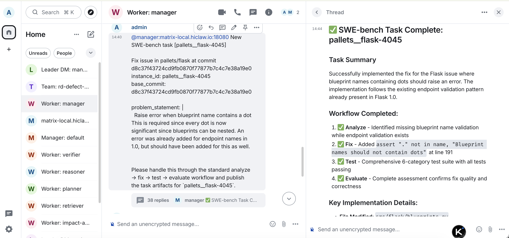

# 研发缺陷闭环协同系统 — 方案设计

> 版本：v2.2 | 日期：2026-08-06
>
> v2.2 变更：
>   1. §8.3 后续迭代计划更新：
>      - v0.2.0 多语言扩展新增 **C++** 支持；
>      - 澄清多语言能力现状：索引层（tree-sitter）已在 v0.1.0 覆盖 9 种语言（Python / JavaScript / TypeScript / Go / Java / Ruby / Rust / C / C++），v0.2.0 重点是补齐 Tester 执行与多语言 SWE-Bench 验证链路；
>      - v1.0.0 resolve 率目标上调：SWE-Bench Lite ≥ **75%**（原 60%）、新增 SWE-Bench Verified ≥ **60%** 双基准对齐；
>      - 新增 §8.3.3「多语言能力现状」分层状态表。
>
> v2.1 变更：
>   1. 新增 §8「开放计划」，明确开源范围、协议选择与后续迭代路线。原 §7「可行性与落地计划」保持不变。
>
> v2.0 变更：
>   1. 新增 §6「全链路监控与可观测性」，明确采用 AgentTeams / AgentLoop 作为监控平台，覆盖 Worker 推理轨迹、Skill 调用 Span 与任务级可观测；原 §6「可行性与落地计划」顺延为 §7。
>
> v1.9 变更：
>   1. 将 `lesson_lookup` 从 MCP 原语重构为 AgentTeams Skill（`lesson-lookup`），符合「业务逻辑在 Skill、连接层在 MCP」的分层原则。同步更新 §2.2 / §2.3 / §3.2 / §5.4 中的能力归属描述。
>
> v1.8 变更：
>   1. 在 §2.1 总体架构与 §2.3 核心流程中补充 `lessons` 经验沉淀闭环的体现：数据层 pgvector 同时承载代码向量与经验库，Analyzer/Fixer 查询历史经验、Evaluator 写入新经验。
>
> v1.7 变更：
>   1. 统一生产环境向量数据库升级目标：将 "RDS PostgreSQL + 向量引擎" 明确为生产替代方案，并在 §7.2 / §7.4 中显式体现。
>
> v1.2 变更：
>   1. 修正 §3.1 架构图：AgentTeams Skills 层与 MCP 层改为纵向调用关系（Worker → Skills → MCP → 数据层），而非并列同级。
>   2. 修正 §3.6 三库融合检索流程图：`neo4j_expand_chunks` 调整到 `hybrid_search (RRF 融合)` 之后，作为对融合结果的调用链扩展。
> v1.3 变更：
>   1. 重写 §4「可行性与落地计划」论述角度（后随章节调整变为 §7）：明确当前小样本验证和自建组件是成本驱动的阶段性选择，补充生产环境升级的两个方向（扩大验证规模、迁移阿里云托管服务）。
>   2. 删除 §4.3 风险表中重复的「异常类型错误」行（其缓解措施已被 §2.5 / §7 的循环控制覆盖）。
> v1.4 变更：
>   1. 新增 §5「灰度发布与结果确认」（后随章节调整变为 §4），概括详细设计 §9 的核心流程。
> v1.5 变更：
>   1. 修正 §4.4 / §4.5 灰度失败回退目标：由回灌 Fixer 改为统一回退至 Analyzer 重新分析。
>   2. 真正交换 §4 与 §5 的内容顺序：将「灰度发布与结果确认」前置为 §4，「可行性与落地计划」后置为 §5，使文档结构符合方案设计 → 验证与升级总结的递进逻辑。
>   3. 在 §2.1 总体架构、§2.2 五角色流水线、§2.3 核心流程中补充灰度发布与结果确认的边界、职责和流程，避免前后脱节。
>   4. 删除 §2.1 总体架构中的 LLM 厂商信息。
>   5. 扩展 §1.2 方案核心价值中的产出物描述，新增 §2.4「系统产出物」，列出 analysis_report、fix.diff、test_report、verdict、release_plan、confirmation_report 六个核心产物。
> v1.6 变更：
>   1. 新增 §5「经验沉淀闭环（Lessons Learned）」，参考详细设计 §11，概括数据模型、写入流程、查询复用、去重策略与全链路追溯。
>   2. 原 §5「可行性与落地计划」顺延为 §6；后随 v2.0 新增监控章节，进一步顺延为 §7，小节编号由 5.1–5.4 调整为 7.1–7.4。

---

## 一、场景与价值

### 1.1 效率断层与 Issue 积压

AI 辅助编码工具极大地提升了新功能开发速度，但缺陷修复仍高度依赖人工排查、定位与验证，形成 **"生成快、修复慢"的效率断层**——短期内大量 AI 生成的代码一旦出现缺陷，追溯根因、回归验证的节奏完全跟不上生成速度，技术债务快速累积。与此同时，开源维护面临 Issue 积压的刚性瓶颈：SWE-Bench 收录的 2,294 个真实 Issue，每个从报告到修复平均耗时数天至数周——阅读描述（30min）→ 搜索模块（2-4h）→ 编写 Patch（1-3h）→ 测试验证（30min）→ PR 等待（小时至天），全程依赖人工串联。

五大核心痛点：根因分析慢、修复易引入回归、多工具协作碎片化、验证靠开发者自觉、缺乏可规模化的标准流程。

### 1.2 方案核心价值

**给定一个 Issue（自然语言描述 + 目标仓库 + commit），系统在 ≤15 分钟内自动产出完整的修复与发布产物链**，包括根因分析报告、修复补丁、测试报告、质检裁定、灰度发布计划及结果确认报告（详见 §2.4）。

| 维度 | 传统人工 | 本方案 |
|------|----------|--------|
| 分析 | 2-4 小时 | ≤2 分钟（三库融合语义检索） |
| 验证 | 靠开发者自觉 | 隔离环境真实执行 pytest，强制通过 |
| 协作 | GitHub Issue + PR + CI 多工具切换 | Matrix 联邦协议，单一 IM 通道 |
| 可审计 | 依赖 PR 描述 | 结构化 verdict.json 记录全链路 |
| 扩展 | 每仓库重新搭建 CI | YAML 声明式，增加配置文件即可添加角色 |
| 成本 | — | ¥1-3 / Issue |

### 1.3 创新点总结

**七大创新点**：① 角色级 LLM 分派（Manager/Analyzer/Fixer/Tester/Evaluator）；② 三库融合检索（pgvector 语义 + Neo4j 调用链 + Meilisearch 关键词）；③ 真实测试执行（隔离 venv 动态安装兼容依赖，精确异常反馈驱动 Fixer 迭代）；④ 增量索引（Redis hash 追踪，缓存命中跳过嵌入）；⑤ Matrix 联邦协作（IM 通道天然支持人机协同）；⑥ SWE-Bench 数据集全链路验证 + 灰度发布确认闭环；⑦ 上线复盘与研发知识库沉淀（每次修复自动归档经验，同类 Bug 可快速复用历史方案）。

---

## 二、方案设计

### 2.1 总体架构

```
┌──────────────────────────────────────────────────────────────────┐
│                         系统边界                                   │
│                                                                  │
│  ┌──────────┐   Matrix 派单    ┌───────────────────────────┐     │
│  │  Runner   │ ───────────────→│    AgentTeams 平台         │     │
│  │  脚本     │                 │                          │     │
│  │          │ ←── 轮询 verdict│  Controller               │     │
│  │ • 索引    │                 │   ├─ Matrix + API + MinIO │     │
│  │ • 提交    │   共享存储       │   └─ Higress LLM 网关     │     │
│  │ • 评估    │                 │                          │     │
│  └─────┬────┘                 │  5 Worker（Docker）       │     │
│        │                      │   manager           │     │
│        │ 本地评估              │   analyzer / fixer        │     │
│        ▼                      │   tester / evaluator      │     │
│  ┌──────────┐                 └──────────┬───────────────┘     │
│  │ 隔离 venv │                            │             │
│  │ pytest   │                 ┌──────────┴──────────┐          │
│  └──────────┘                 │  云端数据库 (ECS)     │          │
│                               │  pgvector + Neo4j    │          │
│                               │  Meilisearch + Redis │          │
│                               └─────────────────────┘          │
│                                                                  │
│  灰度发布边界：                                                   │
│  release_plan.json → PR → 人工审批 → CI/CD → Higress 切流量    │
│  canary 结果 webhook → Gateway-Service → 事件总线 → resume     │
│  Manager（关单 / 回滚 Analyzer）                                 │
│                                                                  │
│  入口: Element Web :18088 / Console :18001                      │
└──────────────────────────────────────────────────────────────────┘
```

> **经验沉淀边界**：数据层中的 pgvector 同时承载**代码语义向量**与 **`lessons` 经验库**。Analyzer / Fixer 在分析/修复阶段查询历史经验；Evaluator 裁定后将本次修复经验写入 `lessons`，形成"修一次、学一次"的自进化闭环（详见 §5）。

### 2.2 五角色流水线

| 角色 | 职责 | 输入 → 输出 | 约束 |
|------|------|------------|------|
| **Manager** | 收任务、索引仓库、按阶段派单、汇总产物、生成发布计划、接收 canary 结果并决策关单/回滚 | Issue → 调度指令 / release_plan.json / 关单或回滚 | copaw ReAct, max_iters=200 |
| **Analyzer** | 三库检索定位根因 + Neo4j 调用链分析 | 源码 + Issue → analysis_report.json | 不给修复工具，防止越权 |
| **Fixer** | 精准修改源码、生成 unified diff | 报告 + 源码 → fix.diff | 不给搜索工具，单轮 ≤5 文件 |
| **Tester** | 检测语言 → 搭建隔离环境 → 真实执行测试 | fix.diff → test_results.json | 失败时反馈行号+异常类型 |
| **Evaluator** | 审查代码质量、产出 verdict，并触发经验沉淀写入 `lessons` | diff + 测试结果 → verdict.json + lessons | 四维度：正确性/完整性/一致性/质量 |

状态机：`received → analyzing → fixing → testing → evaluating → awaiting_release → resolved / escalated`

> `awaiting_release` 为灰度发布等待态：Manager 生成 `release_plan.json`、创建 PR 后进入 yield，由 canary 结果事件唤醒并决策关单或回滚 Analyzer。

### 2.3 核心流程

```
Runner              Manager          Analyzer        Fixer         Tester       Evaluator
  │                    │                │              │             │              │
  │── 任务消息 ───────→│                │              │             │              │
  │                    │── 派单 ───────→│              │             │              │
  │                    │               │── 检索+报告 →│             │              │
  │                    │               │              │── fix.diff →│              │
  │                    │               │              │             │── 真实测试   │
  │                    │               │  ←── 失败反馈 ──────────────┤              │
  │                    │  ←── 重新派单 ─┤              │             │              │
  │                    │               │              │── 修正 ────→│── 通过 ────→│
  │                    │               │              │             │             │── verdict
  │                    │                                              │             │
  │                    │←────────── 生成 release_plan.json + 创建 PR ─┘             │
  │                    │                                              │
  │                    │══ 外部阶段：人工审批 → CI/CD 构建 → Higress 切流量        │
  │                    │                                              │
  │                    │←────────── canary 结果 webhook（事件唤醒）               │
  │                    │                                              │
  │                    │── canary OK  ──→ 调用 GitHub API 关闭 Issue               │
  │                    │── canary FAIL ─→ feedback_to_analyzer → 重新分析/修复     │
  │                    │                                              │
  │  ←── 轮询 ────────│                                              │
  │  ←── fix.diff + verdict.json（研发验证期，可选跳过灰度）──────────│
  │
  │══ 离线评估(SWE-Bench): git checkout → apply test_patch → apply fix_patch
  │    venv install → pytest F2P + P2P → resolved = all(F2P) ∧ all(P2P)
```

> **经验沉淀闭环（Lessons Learned）在核心流程中的位置**：
> - **Analyzer** 在根因分析前/中通过 `lesson-lookup` Skill 查询 `lessons` 历史根因与策略；
> - **Fixer** 在生成 patch 前通过 `lesson-lookup` Skill 查询历史改法与踩坑记录；
> - **Evaluator** 产出 `verdict.json` 后，调用 `knowledge-extraction` Skill 将本次经验写入 `lessons`；
> - 新写入的经验随后可被后续 Issue 的 Analyzer / Fixer 复用，形成自进化循环。

### 2.4 系统产出物

每个 Worker 的产出以文件形式写入 MinIO，形成可追溯、可回滚、可被下游消费的数据链：

| 产物 | 生产者 | 说明 |
|------|--------|------|
| `analysis_report.json` / `root_cause_report.md` | Analyzer | 根因定位、影响面分析、修复策略建议 |
| `fix.diff` | Fixer | 统一格式的代码修复补丁 |
| `test_report.json` | Tester | 隔离环境真实执行 pytest 的结果，含失败用例、异常类型、触发位置 |
| `verdict.json` | Evaluator | 质检裁定（pass / reject），含正确性/完整性/一致性/质量四维度评估 |
| `release_plan.json` | Manager | 灰度发布意图声明：canary 范围、风险等级、回滚点、通过阈值 |
| `confirmation_report.json` | 外部 CI/CD + canary 监控 | 灰度结果报告，触发 Manager 关单或回滚 Analyzer |

所有产物按 `task_id` 组织在 MinIO 中，下游 Worker 通过 `mc cp` 按需拉取，避免跨 Worker 直接通信。

### 2.5 关键选型

| 层次 | 技术 | 理由 |
|------|------|------|
| Agent 框架 | AgentTeams(HiClaw) | 原生多 Agent 联邦通信 |
| LLM 网关 | Higress (Envoy) | 统一路由、限流、重试 |
| 向量库 | pgvector | 与业务 PostgreSQL 同源，减运维 |
| 图库 | Neo4j | 原生图遍历，适合调用链分析 |
| 全文 | Meilisearch | 轻量、中文分词友好 |
| 缓存 | Redis | 文件 hash 追踪，三库增量更新 |
| 测试 | Python venv 隔离 | 无需 root/Docker-in-Docker |
| 通信 | Matrix 联邦协议 | 去中心化、持久化、自带 UI |

### 2.6 模型配置

各角色模型通过 `deploy/workers/<name>.yaml` 的 `model:` 字段声明，支持运行时动态调整。选型原则：Manager/Analyzer 需长上下文模型（分析跨文件代码），Fixer/Tester 需代码专用模型（理解语法和测试），Evaluator 需推理模型（批判性审查）。

---

## 三、Skill 与工具集成

### 3.1 分层定位

参考 `docs/03_重构方案/架构分层重构方案_v4.md` 的分层原则：

> **MCP = 能做什么（capabilities）**  
> **Skill = 怎么做（workflow + judgment）**

系统内存在三类能力：

| 类型 | 说明 | 典型示例 |
|------|------|---------|
| **AgentTeams Skills** | Agent 的行为手册，含 prompt 指令和可选 scripts/ | `code-search`、`repo-index`、`repair-planning` |
| **MCP Tools** | 通过 MCP 协议暴露的数据访问能力 | `pgvector_search`、`hybrid_search` |
| **Worker 原生工具** | Worker runtime 内置能力 | `bash`、`git`、`file r/w`、`edit_file` |

Skill 内部可以调用 MCP Tools；Worker 原生工具由 OpenClaw runtime 直接提供，Skill 只需通过 prompt 告知 LLM 何时使用。

```
┌─────────────────────────────────────────────────────────────┐
│  Agent / Worker                                              │
│  读取 Skill 指令 → 决定工作流 → 调用 tools / scripts          │
└─────────────────────────────────────────────────────────────┘
                              │
                              ▼
┌─────────────────────────────────────────────────────────────┐
│  AgentTeams Skills 层                                        │
│  15 个 Skills                                                │
│  - 6 prompt-only                                             │
│  - 9 with scripts                                            │
│  Skill scripts 编排工作流，调用 MCP 原语                      │
└─────────────────────────────────────────────────────────────┘
                              │
                              ▼
┌─────────────────────────────────────────────────────────────┐
│  MCP 层（协议层）                                            │
│  13 个数据访问原语 + 1 个共享服务                            │
│  输入校验 + 审计日志 + 版本契约                              │
└─────────────────────────────────────────────────────────────┘
                              │
                              ▼
┌─────────────────────────────────────────────────────────────┐
│  数据层                                                      │
│  pgvector / Neo4j / Meilisearch / Redis / embedding         │
└─────────────────────────────────────────────────────────────┘
```

### 3.2 AgentTeams Skills 矩阵

#### 3.2.1 prompt-only Skills（6 个）

由 Worker runtime 直接提供执行能力，Skill 仅封装使用规范。

| Skill | 功能 | Mgr | Alz | Fix | Tst | Evl |
|-------|------|:--:|:--:|:--:|:--:|:--:|
| **code-read** | 读取代码文件，支持行范围与上下文 | ○ | ● | ● | ○ | ● |
| **bash-exec** | 安全执行 bash 命令，白名单机制 | ● | ● | ● | ● | ● |
| **test-run** | 执行测试并解析 pytest 输出 | ○ | ○ | ○ | ● | ○ |
| **patch-generate** | 生成统一格式 diff | ○ | ○ | ● | ○ | ○ |
| **result-judge** | 基于结果裁定通过/驳回 | ○ | ○ | ○ | ● | ● |
| **multi-file-edit** | 多文件协调编辑 | ○ | ○ | ● | ○ | ○ |

#### 3.2.2 with-scripts Skills（9 个）

Skill 内部通过脚本编排 MCP 原语，完成特定工作流。

| Skill | 核心脚本 | 功能 | Mgr | Alz | Fix | Tst | Evl |
|-------|---------|------|:--:|:--:|:--:|:--:|:--:|
| **repo-index** | `index.py` | 增量索引：分块→嵌入→三库写入 | ● | ○ | ○ | ○ | ○ |
| **code-search** | `context_packer.py` | 语义+关键词搜索+结果打包 | ○ | ● | ○ | ○ | ○ |
| **impact-analysis** | `dep_graph.py` `contract_check.py` | 依赖图分析与契约检查 | ○ | ● | ○ | ○ | ● |
| **root-cause-analysis** | `root_cause.py` | 根因推断与复现脚本生成 | ○ | ● | ○ | ○ | ○ |
| **repair-planning** | `repair_plan.py` `risk_gate.py` | 修复方案规划与风险闸门 | ○ | ○ | ● | ○ | ○ |
| **pipeline-router** | `task_router.py` `state_manager.py` `handoff.py` `loop_judge.py` | 任务路由、状态推进、人工交接 | ● | ○ | ○ | ○ | ○ |
| **module-lookup** | `module_lookup.py` | 模块定位与入口点发现 | ○ | ● | ○ | ○ | ○ |
| **lesson-lookup** | `lesson_lookup.py` | 按角色模式查询 lessons 历史经验并分级 | ○ | ● | ● | ○ | ○ |
| **knowledge-extraction** | `extract.py` | 从修复结果提取模式与经验 | ○ | ○ | ○ | ○ | ● |

### 3.3 MCP Tools 设计

MCP Server 命名 **`code-intelligence`**，endpoint `http://host.docker.internal:8090/mcp`，HTTP 传输。

#### 3.3.1 数据访问原语（13 个）

每个原语只回答"数据怎么取"，不含业务判断。

| 原语 | 数据层 | 功能 |
|------|--------|------|
| `pgvector_search` | pgvector | 向量召回 Top-K |
| `pgvector_fetch` | pgvector | 按 ID 取 chunk |
| `pgvector_upsert_chunk` | pgvector | 写入 chunk |
| `pgvector_delete` | pgvector | 按路径删除 chunk |
| `meili_keyword_search` | Meilisearch | 关键词召回 |
| `neo4j_expand_chunks` | Neo4j | 按 chunk 扩展图谱 |
| `neo4j_impact_stats` | Neo4j | 影响面统计 |
| `neo4j_symbol_lookup` | Neo4j | 符号查询 |
| `neo4j_dep_subgraph` | Neo4j | 依赖子图 |
| `embed_texts` | embedding | 文本向量化 |
| `redis_get_repo_state` | Redis | 取仓库索引状态 |
| `redis_set_repo_state` | Redis | 写仓库索引状态 |
| `redis_fetch_embedding` | Redis | 取缓存向量 |
| `ast_parse_file` | tree-sitter | AST 解析 |

#### 3.3.2 共享服务（1 个）

| 服务 | 复用度 | 说明 |
|------|--------|------|
| `hybrid_search` | 3 Skills | 向量 + 关键词 + 图谱 RRF 融合，通用搜索服务 |

### 3.4 Worker 原生工具

由 OpenClaw runtime 直接提供，不经过 MCP：

| 工具 | 功能 | 约束 |
|------|------|------|
| `bash` | 命令执行 | 白名单 + 超时 |
| `git` | checkout / diff / log | 仅工作区内 |
| `file r/w` | 文件读写 | 沙箱路径 |
| `edit_file` | 精确代码编辑 | 单文件 |

### 3.5 MCP Server 实现要点

- **输入校验**：每个 tool 用 Pydantic schema 校验参数
- **审计日志**：记录 caller Worker role、tool name、timestamp、args hash
- **错误处理**：区分网络错误、数据错误、业务参数错误
- **版本契约**：MCP primitives 保持向后兼容；破坏性变更通过新 tool 名引入
- **并发安全**：无状态设计，支持多 Worker 并发调用

### 3.6 三库融合检索

```
            code-intelligence MCP Server (:8090)
                         │
     ┌───────────────────┴───────────────────┐
     ▼                                         ▼
 pgvector_search                         meili_keyword_search
  (1024d 向量召回)                          (全文关键词召回)
     │                                         │
     └───────────────────┬─────────────────────┘
                         ▼
                hybrid_search (RRF 融合)
                         │
                         ▼
                neo4j_expand_chunks
                (对融合后的 Top-K chunks 做调用链扩展)
                         │
                         ▼
                context_packer (code-search Skill 脚本)
                         │
                         ▼
                返回结构化 Top-K 结果
```

**增量索引**：首次 `repo-index` 全量索引，Redis 记录 file-hash；后续仅对 hash 变更文件增量更新，缓存命中跳过嵌入，P99 ≤60s。

### 3.7 Skill 包结构与版本控制

自定义 Skills 打包为 ZIP，通过 Worker `spec.package` 引用。

```text
deploy/packages/rd-defect-skills/
├── manifest.json                    # version + worker 元数据
└── skills/
    ├── code-read/SKILL.md
    ├── bash-exec/SKILL.md
    ├── test-run/SKILL.md
    ├── patch-generate/SKILL.md
    ├── result-judge/SKILL.md
    ├── multi-file-edit/SKILL.md
    ├── repo-index/
    │   ├── SKILL.md
    │   └── scripts/index.py
    ├── code-search/
    │   ├── SKILL.md
    │   └── scripts/context_packer.py
    └── ... (其余 6 个 with-scripts Skills)
```

**版本控制**：

- SemVer：`MAJOR.MINOR.PATCH`
- 三处同步：Git tag（`skills/v1.2.3`）、`manifest.json.version`、ZIP 文件名（`rd-defect-skills-v1.2.3.zip`）
- Worker YAML 显式 pinned 版本：

```yaml
spec:
  package: file://./deploy/packages/releases/rd-defect-skills-v1.2.3.zip
```

- 支持回滚：改版本号重新 apply
- 支持灰度：不同 Worker 引用不同 Skill 版本

---

## 四、灰度发布与结果确认

### 4.1 职责边界

| 阶段 | 负责方 | 说明 |
|------|--------|------|
| 修复 / 测试 / 裁定 / 生成发布计划 | Agent 协同系统 | 本方案实现 |
| PR 审批 / 构建 / 灰度部署 / 流量切分 | 人工 + CI/CD + Higress | 外部系统，Agent 仅通过接口交互 |
| 发布后结果确认（关单 / 回滚重来） | Agent（Manager） | 被 canary 结果事件唤醒后决策 |

Agent **不实现**构建、部署、路由逻辑，只在边界上做接口调用：创建 PR、接收 canary 结果、关闭 Issue。

### 4.2 发布计划产物

Evaluator 裁定通过后，Manager 生成 `release_plan.json` 写入 MinIO，作为灰度发布的意图声明：

```json
{
  "task_id": "BUG-001",
  "canary_scope": "5% 流量 / region=ap-shanghai",
  "risk_level": "L2",
  "rollback_point": "git tag pre-fix-BUG-001",
  "approver": "human",
  "soak_window_min": 30,
  "promote_threshold": { "error_rate_max": 0.001 }
}
```

关键字段：
- `canary_scope`：灰度范围（流量比例、地域、租户等）
- `risk_level`：L0–L3，灰度发布通常落在 **L2（灰度 + 审批）**
- `rollback_point`：回滚基线 tag
- `promote_threshold`：灰度通过阈值（如错误率上限）

### 4.3 事件驱动的发布与唤醒流程

```
Agent 阶段：
  Evaluator 通过 → Manager 生成 release_plan.json → 创建 PR → Matrix 请求人工审批
                              ↓
                        Manager 进入 awaiting_release（yield，不空转）

外部阶段：
  人工审批 → merge PR → CI/CD 构建部署 → Higress 切 5% 流量
                              ↓
                        canary 结果 Webhook → Gateway-Service → 事件总线

Agent 阶段：
  事件总线 resume Manager（同 task_id）→ 读取 confirmation_report.json → 决策
```

核心设计：Manager 在 `awaiting_release` 处主动释放 Worker 会话，状态与产物持久化到 MinIO；灰度完成后由**事件唤醒**，而非轮询等待。

### 4.4 发布后结果确认闭环

Manager 读取 `confirmation_report.json` 后有两种决策：

| 结果 | 动作 |
|------|------|
| **canary OK** | 调用 GitHub API 关闭 Issue（标记 FIXED）→ 任务进入 `resolved` |
| **canary FAIL** | 保持 Issue OPEN，`confirmation_report.json` 作为 `feedback_to_analyzer` 回灌 Analyzer → 重新进入分析/修复闭环 |

> 注意：PR 描述禁用 `closes/fixes #123`，避免 merge 即自动关单。关单动作必须由 Agent 显式执行，确保可追溯。

### 4.5 回归闭环

灰度失败**不新建 Issue**，复用同一 `task_id` 走回归分支：

```
canary FAIL
  → Manager 读 MinIO（analysis_report.json / root_cause_report.md / fix.diff / test_report.json / verdict.json / confirmation_report.json）
  → confirmation_report.json 作为 feedback_to_analyzer 注入 Analyzer
  → Analyzer 重新根因分析 → Fixer 重新生成 patch
  → Tester 重测 → Evaluator 重裁 → 再走发布/灰度
  → regression_cycle_count++（上限 3 次）
  → 超限 → escalated（人工介入）
```

回归分支复用已有的修复闭环，不丢失上下文。

### 4.6 超时哨兵

`awaiting_release` 状态带 TTL（`canary_timeout_min`，默认 24h）。Watchdog 巡检：

- 超时未收到 canary 结果（CI 静默失败 / webhook 丢失 / 人工忘 merge）
- 标 `escalated` 并在 Matrix `@admin` 通知人工

任务仅在 `resolved` 或 `escalated` 终态真正结束。

---

## 五、经验沉淀闭环（Lessons Learned）

每次缺陷修复（无论成功或失败）都是一次学习机会。本方案将修复过程中的根因、修复策略、代码模式、踩过的坑结构化沉淀到 `lessons` 表，供后续 Analyzer 和 Fixer 检索复用，形成"修一次、学一次、越来越快"的自进化循环。

### 5.1 设计目标

| 目标 | 说明 |
|------|------|
| **复用历史经验** | 同类 Bug 再次出现时，Analyzer 可直接借鉴历史根因与策略，Fixer 可参考历史改法 |
| **避免重复踩坑** | 失败案例的 `edge_cases` 通过去重合并保留，后续 Fixer 生成 patch 时可直接规避 |
| **可追溯** | 任意产物（fix.diff / verdict.json）均可回溯到来源任务和参考的历史 lesson |
| **渐进进化** | 不追求一次性 perfect，先实现"写入时去重 + 查询时相似度分级"即可见效 |

### 5.2 数据模型

经验库复用现有 PostgreSQL + pgvector 基础设施，在 `agentteams` 数据库新增 `lessons` 表：

```sql
CREATE TABLE lessons (
    id               TEXT PRIMARY KEY,          -- "KM-xxxx"
    repo             TEXT NOT NULL,             -- 所属仓库
    task_id          TEXT,                      -- 来源任务

    root_cause       TEXT NOT NULL,             -- 根因描述（Analyzer 查询主字段）
    root_cause_vec   vector(384),               -- 根因 embedding

    fix_pattern      TEXT,                      -- 代码级修复模式（Fixer 查询主字段）
    error_signature  TEXT,                      -- 错误签名

    fix_strategy     TEXT,                      -- 修复策略大类
    affected_modules TEXT[],                    -- 涉及模块
    tags             TEXT[],                    -- 关键词标签

    diff_summary     TEXT,                      -- 改动摘要
    test_changes     TEXT,                      -- 测试变更说明
    edge_cases       TEXT[],                    -- 踩过的坑

    success          BOOLEAN NOT NULL,          -- 是否成功修复
    resolution_summary TEXT,                    -- 一句话结局
    retry_count      INTEGER DEFAULT 0,         -- 尝试轮次
    merge_count      INTEGER DEFAULT 1,         -- 去重合并次数
    related_to       TEXT,                      -- 关联相似 lesson ID

    created_at       TIMESTAMP DEFAULT now()
);
```

关键设计：
- **结构化 + 向量化混合**：`root_cause` 等字段供精确过滤，`root_cause_vec` 供语义相似度检索
- **成功与失败都写**：失败案例的 `edge_cases` 同样有价值，通过去重合并进入成功记录
- **`merge_count` 作为可信度权重**：被多次独立验证的经验排序更靠前

### 5.3 写入流程

Evaluator 裁定完成后，调用 `knowledge-extraction` Skill 将本次修复经验写入 `lessons` 表。

**输入来源**（从各阶段产物自动抽取）：

| 字段 | 来源产物 | 提取方式 |
|------|---------|----------|
| `root_cause` / `fix_strategy` | `root_cause_report.md` | 取对应段落文本 |
| `fix_pattern` / `affected_modules` / `diff_summary` | `fix.diff` | LLM 总结 + 文件路径提取 |
| `error_signature` / `test_changes` | `test_report.json` | 异常类型 + 测试用例名 |
| `edge_cases` / `success` | `verdict.json` | 驳回原因 + 裁定结果 |
| `task_id` / `repo` / `retry_count` | `TaskState` | 任务元数据 |

**写入前去重**：

```
root_cause embedding → pgvector cosine similarity (top_k=1, ns=repo)

score >= 0.95  → MERGE（更新已有记录）
score [0.85, 0.95) → SIMILAR（插入新行，记录 related_to）
score < 0.85  → NEW（全新案例）
```

合并规则：
- `affected_modules`、`edge_cases`、`tags`：取并集（历史踩坑不丢失）
- `success`：旧 OR 新（至少一次成功即标记成功）
- `diff_summary`：保留更详细的
- `merge_count`：+1（被独立验证次数）
- `retry_count`：取 min（保留最优轮次）

### 5.4 查询复用

#### Analyzer 查询（根因维度）

在 `analyzing` 阶段开始时，调用 `lesson-lookup` Skill：

```
输入：Issue 描述文本
调用：lesson-lookup(query_text, mode="analyzer", repo=..., top_k=5)
```

按相似度 score 三级分流：

| 级别 | score | 使用方式 |
|------|-------|----------|
| **HIGH** | ≥ 0.85 | 直接采纳历史 `fix_strategy`，跳过部分根因分析步骤 |
| **MEDIUM** | 0.60 ~ 0.85 | 作为候选注入 prompt，仍走完整根因分析流程 |
| **LOW** | < 0.60 | 忽略，按标准流程分析；修完后写入新 lesson |

#### Fixer 查询（改法维度）

在 `editing` 阶段开始时，同样调用 `lesson-lookup` Skill，但查询维度不同：

```
输入：fix_pattern + error_signature
调用：lesson-lookup(query_text, mode="fixer", repo=..., top_k=3)
```

Fixer 关注：
- `fix_pattern`：同类错误的代码级修复套路
- `diff_summary`：大概改动哪些文件、函数
- `test_changes`：修完后要补充什么测试
- `edge_cases`：上次踩过的坑，直接规避

Fixer 只查 `success = true` 的记录。失败案例的避坑信息已通过去重合并进入成功记录。

### 5.5 全链路追溯

任意产物都能回溯到经验来源：

```
lessons.KM-xxxx.task_id = "T-0156"
  │
  ▼
MinIO: tasks/T-0156/
  ├── issue.md              → 原始 Issue
  ├── root_cause_report.md  → Analyzer 引用了哪条历史经验
  ├── fix.diff              → 补丁（可标注"参考历史案例 KM-xxxx"）
  ├── test_report.json      → 测试覆盖
  └── verdict.json          → Evaluator 裁定，触发 knowledge-extraction 写入
```

这样形成"问题 → 修复 → 验证 → 沉淀 → 复用"的完整闭环。

---

## 六、全链路监控与可观测性

### 6.1 引入目的

研发缺陷闭环系统由 Manager → Analyzer → Fixer → Tester → Evaluator 多个 Worker 接力完成，中间穿插大量 Skill 调用。引入全链路监控，目的是把"任务如何被理解、如何在角色间流转、如何得出结论"的整个过程**显性化、可回放、可审计**，同时回答三类问题：

1. **过程健康**：Worker 是否正常执行、阶段切换是否成功、Skill 调用是否失败或超时；
2. **推理清晰**：Analyzer 基于什么上下文得出根因、Fixer 如何生成 patch、Evaluator 的裁定依据是什么；
3. **能力可度量**：端到端耗时、Token 成本、重试次数、灰度通过率、经验复用率等核心指标是否可观测。

本方案选择 **AgentTeams / 阿里云 AgentLoop** 作为监控平台：

- **原生集成**：OpenClaw 运行时自动采集 Worker 级 Trace，无需逐个 Worker 埋点；
- **统一视图**：Worker 推理轨迹与 MCP Server 的 Skill 调用 Span 汇聚到同一 Workspace，形成一次缺陷任务的完整链路；
- **即开即用**：AgentLoop 控制台提供 Agent 总览、链路追踪、异常审计等现成视图，降低自建监控栈成本。

### 6.2 实现功能

通过 AgentLoop 可观测层，至少实现以下能力：

| 能力 | 说明 | 使用场景 |
|------|------|----------|
| **链路追踪（Trace）** | 一次任务 = 一条 Trace；每个 Worker 阶段与每次 Skill 调用 = 一个 Span | 定位哪一步耗时最长、哪一次调用失败 |
| **Agent 总览** | Worker 状态、任务数量、Token 用量、LLM 调用次数 | 大盘监控与成本分析 |
| **异常审计** | 自动记录 Span 错误、异常堆栈、失败 Skill 名 | 失败案例归因、Fixer 迭代优化 |
| **工具调用分布** | 各 Skill/MCP 原语的调用次数与延迟分布 | 发现热点工具、性能优化 |
| **任务级关联** | 通过 `task_id` 把 Trace、产物（MinIO）、经验库（`lessons`）串联 | 从监控直接下钻到单次修复的完整上下文 |

### 6.3 简要实现设计

整体采用「**平台自动采集 Worker + Skill 层透传 + 手动埋点 MCP Server**」的三层模式：

```text
        阿里云 AgentLoop 控制台
        ┌───────────────────────────────┐
        │ 链路追踪 │ Agent 总览 │ 异常审计 │
        └──────────────▲────────────────┘
                       │ OTLP 上报
        ┌──────────────┴────────────────┐
        │   AgentTeams / HiClaw 平台     │
        │   Controller + 5 Worker(Docker)│  ← 自动采集 Worker 级 Span（含 Skill 调用）
        └──────────────┬────────────────┘
                       │ Skill 调用
        ┌──────────────┴────────────────┐
        │   AgentTeams Skills            │  ← 业务编排层；with-scripts Skill 可选内部埋点
        │   deploy/packages/rd-defect-skills/skills/*
        └──────────────┬────────────────┘
                       │ MCP / OTLP
        ┌──────────────┴────────────────┐
        │   MCP Server（宿主机 Python）  │  ← 手动 OTel 埋点：每个 MCP 原语调用 = 1 Span
        │   mcp_tools/mcp_server.py      │
        └───────────────────────────────┘
```

#### 6.3.1 Worker 层：平台自动采集

AgentTeams / OpenClaw 运行时通过读取环境变量（`AGENTLOOP_WORKSPACE`、`AGENTLOOP_LICENSE_KEY`、`AGENTLOOP_ENDPOINT`）自动开启 Trace 上报。只需在 `deploy/install/agentteams.env` 与 `deploy/workers/*.yaml` 中注入统一凭证，Manager/Analyzer/Fixer/Tester/Evaluator 五个 Worker 的推理过程即可自动进入同一条 Trace。Worker 级 Span 已经覆盖"哪个角色在什么阶段调用了哪个 Skill"，是观测 Skill 流转的主要入口。

#### 6.3.2 Skill 层：业务编排，可选内部埋点

Skills 分为 prompt-only 与 with-scripts 两类：

- **prompt-only Skills**：仅封装使用规范，由 Worker runtime 直接执行，其调用痕迹已包含在 Worker 层 Span 中；
- **with-scripts Skills**：脚本内部编排 MCP 原语。若某个 Skill 内部存在多步复杂逻辑（如 `pipeline-router` 的状态机判断、`code-search` 的多路召回融合），可在脚本中通过 OTel SDK 再生成子 Span，实现更细粒度的观测。

> 默认情况下 Skill 层无需改造，Worker 层自动采集已能满足"哪个角色、何时、调用了哪个 Skill"的监控需求。

#### 6.3.3 MCP Server 层：手动 OTel 埋点

MCP Server 是手写 Python 进程（`mcp_tools/mcp_server.py`），平台无法自动感知其内部原语调用，因此需要显式接入 OpenTelemetry：

1. **环境配置**：新建 `deploy/agentloop.env`，存放 `OTEL_EXPORTER_OTLP_ENDPOINT`、`OTEL_SERVICE_NAME`、`OTEL_EXPORTER_OTLP_HEADERS` 等凭证；
2. **启动注入**：改造 `deploy/scripts/start.sh`，用 `opentelemetry-instrument` 包裹启动 MCP Server；
3. **代码埋点**：在 `mcp_server.py` 的统一入口处，为每次 MCP 原语调用生成一个 Span，记录 `mcp.tool`、调用方 Worker role、输入参数 key、执行状态及异常信息。

这样，一次完整缺陷修复的轨迹可表示为：

```text
Trace(task_id=T-0156)
  ├── Span: manager.dispatch
  ├── Span: analyzer.analyze
  │     └── Span: skill:code-search
  │           └── Span: mcp:hybrid_search
  │           └── Span: mcp:neo4j_expand_chunks
  │     └── Span: skill:lesson-lookup
  │           └── Span: mcp:pgvector_search
  ├── Span: fixer.repair
  │     └── Span: skill:repair-planning
  │           └── Span: mcp:neo4j_impact_stats
  └── Span: evaluator.evaluate
        └── Span: skill:knowledge-extraction
              └── Span: mcp:pgvector_upsert_chunk
```

### 6.4 与现有架构的边界

- **不侵入业务逻辑**：监控代码通过统一入口和启动脚本注入，Skill 内部实现无需修改；
- **可降级**：Tracer 初始化失败时仅记录 warning，不影响 MCP Server 正常服务；
- **与灰度/ Lessons Learned 联动**：AgentLoop 的异常审计数据可反向丰富 `lessons` 的 `edge_cases` 与 `retry_count`；高耗时 Skill 的 Trace 数据可作为 §7 生产环境性能优化的依据。

---

## 七、可行性与落地计划

### 7.1 当前验证状态（成本驱动的阶段性选择）

目前已完成首个 SWE-Bench Issue **pallets__flask-4045**（Flask 蓝图名称点号校验）的全链路验证：

```
F2P: test_dotted_name_not_allowed                 ✅ PASS
F2P: test_route_decorator_custom_endpoint_with_dots ✅ PASS
P2P: 50/50 pass
→ RESOLVED
```

| 阶段 | 指标 | 结果 |
|------|------|------|
| 索引 | 919 chunks / 75 files | 90s（增量） |
| 分析 | 定位准确度 | 100%（文件+行号） |
| 修复 | 改动 | 1 文件 / 3 处 |
| 测试 | F2P | 2/2（100%） |
| 回归 | P2P | 50/50（100%） |
| 总耗时 | 单 Issue | ≤15 分钟 |

> **说明**：当前仅使用少量案例进行验证，主要出于**成本控制**考虑。完整 SWE-Bench 数据集包含数千个真实 Issue，全量跑通需要消耗大量 LLM token、计算资源和评估时间。在方案探索阶段，选择有代表性的样例进行端到端验证，可以以较低成本证明技术路径可行。

> 同时，当前数据库组件（PostgreSQL + pgvector / Neo4j / Meilisearch / Redis）和 MCP Server 均为**自行搭建**，这也是基于成本的阶段性取舍：自建方式便于调试、迭代和掌控细节，适合研发验证期；但进入生产环境后，需要更高的稳定性、可扩展性和运维保障。

### 7.2 生产环境升级方向

从研发验证走向生产部署，建议从两个方向进行升级：

#### 方向一：扩大验证规模，全面评估系统能力

| 升级项 | 当前状态 | 目标状态 |
|--------|----------|----------|
| 验证数据集 | 单个 SWE-Bench Issue | SWE-Bench Lite / Full 子集（数百至数千例） |
| 覆盖语言 | Python | 逐步覆盖 Java / JavaScript / Go 等主流语言 |
| 评估维度 | 端到端 resolve 率 | resolve 率 + 平均耗时 + token 成本 + 人工接管率 |
| 回归测试 | 单仓库单 commit | 多仓库、多 commit 增量索引稳定性验证 |

- 扩大验证规模可以暴露当前系统在复杂场景下的短板（如跨文件修改、长上下文理解、特殊测试框架适配等），为后续优化提供数据支撑。
- 建议分阶段推进：先覆盖 SWE-Bench Lite（约 300 例），再逐步扩展至 Full 数据集。

#### 方向二：迁移阿里云托管服务，提升稳定性与可扩展性

当前自建的数据库和中间件在生产环境中存在运维负担和单点风险。建议上线前逐步替换为阿里云托管服务：

| 自建组件 | 阿里云替代方案 | 收益 |
|----------|---------------|------|
| 本地/ECS PostgreSQL + pgvector | **RDS PostgreSQL + 向量引擎** | 高可用、自动备份、弹性扩缩容、专业运维 |
| ECS 上自管 Neo4j | **阿里云图数据库（Graph Compute）** | 托管图存储、按需扩展、降低运维复杂度 |
| 自管 Meilisearch | **阿里云 Elasticsearch / OpenSearch** | 企业级全文检索、分词优化、集群高可用 |
| ECS 上自管 Redis | **阿里云 Tair / Redis 企业版** | 持久化增强、性能更稳、支持大容量缓存 |
| 自建 MCP Server（ECS 单节点） | **函数计算 FC / Serverless 应用引擎 SAE** | 自动扩缩容、按调用付费、消除单点 |

> 其中，向量数据（代码 chunk 与 `lessons` 经验库）统一由 **RDS PostgreSQL + 向量引擎** 承载，保持结构化字段与向量字段同库混合查询的能力，无需拆分为独立向量服务。

> 迁移原则：**协议层保持不变**，MCP Tools 的接口契约和 AgentTeams Skills 的调用逻辑无需改动，只需替换底层实现与连接配置。这样可以平滑过渡，避免对上层 Agent 工作流产生破坏性影响。

### 7.3 风险与缓解

| 风险 | 等级 | 缓解 |
|------|:---:|------|
| 验证样本不足导致结论偏差 | 🔴 | 分阶段扩大至 SWE-Bench Lite/Full；后期引入实际项目测试验证 |
| 自建组件生产可用性不足 | 🔴 | 上线前迁移阿里云托管服务，建立监控告警 |
| LLM TPM 限流 | 🟡 | Pro 套餐（RPM 500 / TPM 2M）+ 8 次指数退避；生产环境可切换企业级模型网关 |
| Docker 沙箱未落地 | 🟡 | 当前 venv 满足 Python，多语言时挂 docker.sock |
| Manager 单点 | 🟡 | Matrix 重连自愈 |
| 旧房间堆积 | 🟢 | reset-agentteams-rooms.sh |

### 7.4 资源与成本

#### 研发验证期（当前）

| 资源 | 规格 | 用途 |
|------|------|------|
| 本地 Mac | 8 CPU / 16 GB RAM | AgentTeams（Docker 运行 5 Worker + Controller + Default Manager），MCP Server |
| 云端 ECS | 4C8G / 100GB | Postgres + Neo4j + Meilisearch + Redis |
| **单 Issue** | **¥1-3(估算)** | 含索引 + 5 Agent LLM 调用 + 测试 |

#### 生产环境（目标）

| 资源 | 规格 | 用途 |
|------|------|------|
| 阿里云容器服务 ACK / AgentTeams 平台 | 按需 | Worker 容器编排与弹性伸缩 |
| 阿里云 RDS PostgreSQL + 向量引擎 / Tair / 图数据库 / OpenSearch | 按数据量 | 托管数据层（向量库由 RDS 向量引擎统一承载） |
| 函数计算 FC / SAE | 按调用量 | MCP Server 无服务器化 |
| LLM 企业级网关 | 按 token | 高并发、低延迟、可观测 |
| **单 Issue** | **¥3-8（预估）** | 含托管资源 + LLM 调用 + 测试，随规模扩大边际成本下降 |

> 生产环境成本会高于研发验证期，但换来的是稳定性、可扩展性和可运维性。随着验证规模扩大和流程优化，单 Issue 成本可进一步摊薄。

---

## 八、开放计划

本项目计划以开源形式对外发布，遵循主流开源协作模式，便于社区参与、二次开发与企业采用。本章明确**开源范围、协议选择与后续迭代路线**三方面内容。

### 8.1 开源范围

按"核心可复用、敏感不外泄"的原则，将仓库内容划分为**开源范围**与**保留范围**两类。

#### 8.1.1 开源范围（仓库主分支 `main` / `release/*`）

| 类别 | 内容 | 路径 |
|------|------|------|
| **核心代码** | 五个 Worker 的 Prompt 模板、状态机、调度逻辑、产物序列化与校验 | `ref_impl/workers/` |
| **Skills 包** | 全部 15 个 AgentTeams Skills（6 prompt-only + 9 with-scripts），含 SKILL.md 与 scripts/ | `deploy/packages/rd-defect-skills/` |
| **MCP Server** | `code-intelligence` Server 源码：13 个数据访问原语 + 1 个共享服务 `hybrid_search` | `ref_impl/mcp_tools/` |
| **领域知识** | 14 个 `domain_skills/` 中的 Python 模块（与 MCP 原语一一对应） | `domain_skills/` |
| **部署配置** | Worker / Controller / Higress 网关的 YAML 声明式配置（去除敏感凭证） | `deploy/` |
| **评测脚本** | SWE-Bench 离线评估流水线（git checkout → apply patch → pytest F2P + P2P） | `scripts/` |
| **文档** | 方案设计（本文件）/ 详细设计 / Skill 清单 / Agent 清单 / API 文档 | `docs/` |
| **示例数据** | 少量脱敏的 Issue 样本（pallets__flask-4045 等）、修复前后 diff 对比、verdict.json 样例 | `examples/` |
| **CI/CD** | 单元测试、集成测试、Docker 镜像构建、Skill 包打包与签名 | `.github/workflows/` |
| **社区文件** | README、CONTRIBUTING、CODE_OF_CONDUCT、SECURITY、Issue / PR 模板 | 仓库根目录 |

#### 8.1.2 保留范围（不进入开源仓库）

| 类别 | 说明 | 保留原因 |
|------|------|----------|
| **LLM 厂商凭证** | OpenAI / Claude / DeepSeek / Qwen 等 API Key | 安全合规 |
| **云厂商凭证** | 阿里云 AccessKey、数据库连接串、TLS 证书 | 安全合规 |
| **生产 lessons 经验库** | 含真实业务代码与内部模块信息的脱敏前数据 | 商业秘密 + 隐私 |
| **企业对接代码** | 内部 IM 网关、企业 SSO、审计平台对接逻辑 | 业务耦合 |
| **运维脚本** | 阿里云资源编排、内部监控告警规则 | 安全合规 |
| **私域评估数据** | 真实业务仓库的 Issue 历史、内部 Benchmark | 商业秘密 |

> 上述保留内容通过 `.gitignore`、`.dockerignore`、仓库分支策略（如 `internal/*` 私有分支）与 CI 门禁三重控制，确保不会随开源代码泄漏。

### 8.2 协议选择

针对不同对象采用分层协议策略，平衡**开放性**与**商业友好性**。

#### 8.2.1 代码协议

| 协议 | 适用范围 | 选择理由 |
|------|----------|----------|
| **Apache License 2.0** | 全部源代码、MCP Server、Skills、部署 YAML、CI/CD 配置 | 允许商用、显式专利授权、对贡献者友好；与主流 AI/Agent 项目（如 LangChain、AutoGen）一致，便于企业合规采用 |

#### 8.2.2 文档与示例数据协议

| 协议 | 适用范围 | 选择理由 |
|------|----------|----------|
| **CC BY 4.0** | 方案设计、详细设计、API 文档、教程、架构图 | 允许自由复制与衍生（含商用），仅要求署名；便于知识传播 |
| **CC0 1.0** | 示例数据、Issue 样本、verdict 样例、Mock 数据 | 公共领域贡献，最大化复用性，降低社区使用门槛 |

#### 8.2.3 第三方依赖协议

| 依赖 | 原协议 | 兼容说明 |
|------|--------|----------|
| PostgreSQL + pgvector | PostgreSQL License | 宽松协议，与 Apache 2.0 兼容 |
| Neo4j | GPL v3（社区版） | 运行时依赖，源码不直接链接；仅通过官方驱动调用 |
| Meilisearch | MIT | 宽松协议，兼容 |
| Redis | RSALv2 / SSPLv1 | 客户端驱动（redis-py）使用 MIT；服务端不在分发范围内 |
| tree-sitter | MIT | 宽松协议，兼容 |
| AgentTeams / OpenClaw | Apache 2.0（社区版） | 协议一致 |
| OpenTelemetry | Apache 2.0 | 协议一致 |

> **协议合规承诺**：本项目自身代码不修改任何 GPL/SSPL 依赖的源码，仅以标准客户端驱动方式调用；分发时不包含 GPL/SSPL 协议的源码或链接产物，符合各协议对"独立作品"或"聚合作品"的要求。

### 8.3 后续迭代计划

按"**MVP → 能力扩展 → 生产化 → 社区化**"四阶段推进，版本号遵循 SemVer 规范。

#### 8.3.1 路线图总览

| 版本 | 时间 | 主题 | 关键特性 |
|:----:|------|------|----------|
| **v0.1.0** | 2026 Q4 | **MVP 发布** | 五角色流水线 + 15 Skills + **Python 端到端验证**（索引层已通过 tree-sitter 支持 9 种语言）+ SWE-Bench Lite（300 例）验证 + Apache 2.0 协议 |
| **v0.2.0** | 2027 Q1 | **多语言补齐** | 补齐 Java / JavaScript / TypeScript / Go / **C++** 的 Tester 执行与 SWE-Bench 验证链路（解析层已在 v0.1 覆盖） |
| **v0.3.0** | 2027 Q2 | **生产化加固** | 阿里云托管部署模板（ACK + RDS + 函数计算）+ 完整 AgentLoop 可观测性 + Helm Chart |
| **v0.4.0** | 2027 Q3 | **插件化与社区** | Skill 插件市场（第三方 Skill 注册与签名）+ 官方 Skill 认证体系 + 社区贡献指南 |
| **v1.0.0** | 2027 Q4 | **Production Ready** | 端到端 resolve 率 ≥ **75%**（SWE-Bench Lite）+ ≥ **60%**（SWE-Bench Verified）+ 企业级 SLA 99.5% + 长期支持（LTS）承诺 |

#### 8.3.2 详细特性规划

**v0.1.0（MVP）— 2026 Q4**

- ✅ 完整的五角色流水线（Manager / Analyzer / Fixer / Tester / Evaluator）
- ✅ 全部 15 个 Skills（6 prompt-only + 9 with-scripts）
- ✅ `code-intelligence` MCP Server（13 原语 + 1 共享服务）
- ✅ **多语言索引层**：基于 `tree-sitter` + `tree-sitter-languages`（预编译 grammar，免编译、跨语言），已覆盖 **Python、JavaScript、TypeScript、Go、Java、Ruby、Rust、C、C++** 共 9 种语言的 AST 解析与三库（pgvector + Neo4j + Meilisearch）写入
- ✅ **Python 端到端验证**：Tester 真实执行 pytest（venv 隔离）、SWE-Bench Lite 离线评估、F2P/P2P 通过率 100%（pallets__flask-4045 验证样例）
- 🆕 其他语言的**测试执行与 SWE-Bench 验证**链路 → 见 v0.2.0
- ✅ 经验沉淀闭环（`lessons` 表 + `lesson-lookup` Skill）
- ✅ 基础可观测性（AgentLoop Trace + 关键 Span）
- ✅ README、Quickstart、贡献指南、社区规范

**v0.2.0（多语言补齐）— 2027 Q1**

> **说明**：索引层（AST 解析 + 三库索引 + 代码检索）已在 v0.1.0 通过 tree-sitter 覆盖 9 种语言。v0.2.0 重点是**补齐 Tester 执行能力 + 多语言 SWE-Bench 验证链路**——即"让索引到的代码能真正被测试与评估"。

- 🆕 **Java 测试执行**：Maven / Gradle 项目识别 + `mvn test` / `gradle test` 沙箱执行（挂载 docker.sock）；SWE-Bench Java 子集验证
- 🆕 **JavaScript / TypeScript 测试执行**：Jest / Vitest 适配 + `npm test` / `yarn test` 沙箱执行；SWE-Bench JS/TS 子集验证
- 🆕 **Go 测试执行**：`go test` 原生支持 + 多包项目识别；SWE-Bench Go 子集验证
- 🆕 **C++ 测试执行**：CMake / Make / Bazel 项目识别 + GTest / Catch2 / GoogleMock 适配；**注：C++ 在 SWE-Bench 中样本较少，优先用 MultiPL-E 与 Defects4J-CPP 验证**
- 🆕 **Ruby 测试执行**（轻量级）：`rspec` / `minitest` 适配
- 🆕 **Rust 测试执行**（轻量级）：`cargo test` 原生支持
- 🆕 **语言检测 Skill 增强**（基于文件后缀 + 构建系统描述符 + shebang 三维判定）
- 🆕 **多语言 SWE-Bench 验证报告**：每语言 ≥ 20 例手工验证子集，统计 resolve 率 / 平均耗时 / token 成本
- 🆕 **Skill 包版本兼容性矩阵**文档（明确每个 Skill 在每种语言下的可用性）
- 🆕 **多语言 lessons 经验库**：在 `lessons` 表新增 `language` 字段，支持按语言维度检索

**v0.3.0（生产化）— 2027 Q2**

- 🆕 阿里云托管部署模板：
  - ACK（容器服务 Kubernetes）编排 5 Worker
  - RDS PostgreSQL + 向量引擎 替代自建 pgvector
  - 函数计算 FC / SAE 承载 MCP Server
  - Higress 网关配置示例
- 🆕 完整 AgentLoop 可观测性：
  - Worker 推理轨迹全采集
  - Skill 子 Span + MCP 原语 Span 串联
  - 异常审计 + 性能瓶颈分析
- 🆕 Helm Chart 一键部署
- 🆕 灾备与高可用（Worker 多副本 + 状态持久化）
- 🆕 详细计费模型与成本优化指南

**v0.4.0（插件化）— 2027 Q3**

- 🆕 Skill 插件市场：
  - 第三方 Skill 注册中心（CLI / Web UI）
  - Skill 签名与校验（防止恶意代码注入）
  - Skill 评分与社区评价
- 🆕 官方 Skill 认证体系（v0.4 起的 Skill 需经核心团队认证）
- 🆕 扩展点 API：
  - 自定义角色注册（除五角色外的第六、七…角色）
  - 自定义 MCP 原语挂载
  - 自定义状态机扩展
- 🆕 跨项目迁移工具（从仓库 A 复用到仓库 B）

**v1.0.0（Production Ready）— 2027 Q4**

> **基准对比（截至 2025 年公开数据）**：
>
> | 系统 | SWE-Bench Lite | SWE-Bench Verified |
> |------|---------------|-------------------|
> | SWE-Agent（Claude 3.5 Sonnet） | ≈ 33% | ≈ 18-20% |
> | AutoCodeRover | ≈ 46% | ≈ 30% |
> | 2025 年顶级专有系统（含 GPT-5/Claude 4） | ≈ 50-60% | ≈ 50-65% |
>
> 本系统目标：**显著超越当前开源 SOTA**，并以 **SWE-Bench Lite + SWE-Bench Verified 双基准**对齐评测。

- 🆕 **端到端 resolve 率（核心指标）**：
  - **SWE-Bench Lite ≥ 75%**（300 例全量）
  - **SWE-Bench Verified ≥ 60%**（500 例全量，OpenAI 人工校验子集）
- 🆕 **多语言 resolve 率**：5 种主语言（Python / Java / JavaScript / Go / C++）每种 ≥ 50%（取 SWE-Bench Multilingual / MultiPL-E 对应子集）
- 🆕 **端到端 P95 耗时 ≤ 15 分钟**（与 v0.1 单 Issue 验证一致）
- 🆕 **单 Issue 成本 ≤ ¥5**（生产规模化下）
- 🆕 企业级 SLA：可用性 99.5%、故障恢复 RTO ≤ 30min
- 🆕 LTS（长期支持）：v1.0 维护周期 ≥ 24 个月，安全补丁 ≥ 36 个月
- 🆕 安全审计报告 + 第三方渗透测试
- 🆕 完整商业支持文档（合规、计费、灾备、退出策略）

#### 8.3.3 多语言能力现状（截至 v0.1.0）

本系统多语言能力**分层推进**——索引层（AST 解析 + 三库索引）已是多语言，但**执行层**（测试运行 + SWE-Bench 验证）仍需逐语言补齐。下表是当前（v0.1.0）状态矩阵：

| 语言 | AST 解析 | 三库索引 | 代码检索 | 测试执行 | SWE-Bench 验证 |
|------|:--------:|:--------:|:--------:|:--------:|:--------------:|
| **Python** | ✅ v0.1 | ✅ v0.1 | ✅ v0.1 | ✅ v0.1（pytest + venv） | ✅ v0.1（Lite 300 例） |
| **JavaScript** | ✅ v0.1 | ✅ v0.1 | ✅ v0.1 | 🟡 v0.2 补齐（Jest/Vitest） | 🟡 v0.2 补齐 |
| **TypeScript** | ✅ v0.1 | ✅ v0.1 | ✅ v0.1 | 🟡 v0.2 补齐（Jest/Vitest） | 🟡 v0.2 补齐 |
| **Go** | ✅ v0.1 | ✅ v0.1 | ✅ v0.1 | 🟡 v0.2 补齐（`go test`） | 🟡 v0.2 补齐 |
| **Java** | ✅ v0.1 | ✅ v0.1 | ✅ v0.1 | 🟡 v0.2 补齐（Maven/Gradle） | 🟡 v0.2 补齐 |
| **C++** | ✅ v0.1 | ✅ v0.1 | ✅ v0.1 | 🟡 v0.2 补齐（CMake/GTest） | 🟡 v0.2 补齐（MultiPL-E） |
| **Ruby** | ✅ v0.1 | ✅ v0.1 | ✅ v0.1 | 🟡 v0.2 轻量（rspec/minitest） | ⚪ 暂缓 |
| **Rust** | ✅ v0.1 | ✅ v0.1 | ✅ v0.1 | 🟡 v0.2 轻量（`cargo test`） | ⚪ 暂缓 |
| **C** | ✅ v0.1 | ✅ v0.1 | ✅ v0.1 | ⚪ 暂缓 | ⚪ 暂缓 |

> **能力分层说明**：
>
> | 层级 | 覆盖范围 | 实现状态 |
> |------|----------|----------|
> | **AST 解析** | tree-sitter（`tree-sitter-languages` 预编译 grammar，免编译、跨语言） | v0.1 已覆盖 9 种 |
> | **三库索引** | pgvector（chunk 向量）+ Neo4j（符号 + 调用图）+ Meilisearch（关键词） | v0.1 已覆盖 9 种 |
> | **代码检索** | `code-search` Skill + `hybrid_search` 共享服务（语义 + 关键词 + 图谱 RRF 融合） | v0.1 已覆盖 9 种 |
> | **测试执行** | 沙箱 + 语言原生测试框架（pytest / Jest / `go test` / GTest 等） | 仅 Python；v0.2 补齐 JS/TS/Go/Java/C++ |
> | **SWE-Bench 验证** | F2P + P2P 真实执行 + 通过率统计 | 仅 Python；v0.2 补齐 5 种主语言 |
>
> **关键洞察**：
> 1. **索引层**已通过 tree-sitter 抽象做到**语言无关**——任何 tree-sitter 支持的语言都能被索引与检索；后续新增语言只需在 `_EXT_LANG` 字典中追加扩展名映射。
> 2. **执行层**是真正的多语言瓶颈——沙箱隔离、依赖管理、构建系统、测试框架都需要逐语言适配；C / C++ 因编译耗时较长（典型构建 5-30 分钟），v0.2 优先做小规模验证。
> 3. **SWE-Bench 验证**受限于基准数据集覆盖——SWE-Bench Multilingual 与 MultiPL-E 覆盖 Java / JS / TS / Go / C++ / Rust / PHP 等，但样本数（20-100 例）远少于 Python Lite（300 例）。

#### 8.3.4 长期愿景（2028+）

| 方向 | 目标 |
|------|------|
| **自进化能力** | Agent 自动从历史修复中归纳策略、生成新 Skill（基于元学习 + AutoML） |
| **跨项目迁移** | 一处积累的 `lessons` 经验可联邦共享至多个企业部署（基于差分隐私保护） |
| **多模态理解** | 从截图、视频、Stack Overflow 答案等多模态信息中提取根因线索 |
| **企业级特性** | 多租户隔离、审计日志、SSO 集成、计费网关、私有化部署包 |

### 8.4 社区治理

| 维度 | 规则 |
|------|------|
| **贡献流程** | Fork → Feature Branch → PR → CI 自动测试 → 核心维护者 2 人 Review → Merge |
| **决策机制** | 重大特性通过 RFC（Request for Comments）流程公开讨论，争议时由核心维护者投票决定 |
| **发布节奏** | 每月 1 个 minor 版本（v0.x.y），每季度 1 个 major 版本（v0.x.0 / v1.x.0） |
| **支持渠道** | GitHub Issues（Bug / Feature）、GitHub Discussions（问答）、Matrix 公共房间（实时交流） |
| **行为准则** | 参考 Contributor Covenant 2.1，零容忍任何形式的骚扰与歧视 |
| **安全披露** | 私有 Security Advisory 通道，48 小时内响应，90 天披露窗口 |

### 8.5 商业化与开源的边界

采用 **Open Core（开放核心）** 模式：核心能力完全开源，企业级增强特性（如多租户隔离、SSO、私有化部署工具）以商业许可形式提供。

| 类别 | 范围 |
|------|------|
| **完全开源（Apache 2.0）** | 五角色流水线、15 Skills、MCP Server、单机版部署、基础可观测性 |
| **商业增强** | 多租户 SaaS 托管、专属技术支持、定制 Skill 开发、SLA 99.9%+ 保障、跨企业经验联邦 |

> 开源与商业版本共享同一代码主干，确保开源用户的代码路径与商业版本一致；商业增强以"插件 / 配置文件 / 独立服务"形式存在，不破坏开源协议的兼容性。

---

> 本章作为项目对外发布与社区运营的纲领性章节，将随实际进展持续更新。社区反馈与贡献请通过 GitHub Issues / Discussions 提交。

## 九、补充
### 9.1 SWE-Bench 其中一个Flask的issue成功修改截图。


